# Problem Generation System - LangGraph Workflow

LLM 기반 학습 문제 자동 생성 시스템의 LangGraph 워크플로우

---

## Problem Workflow

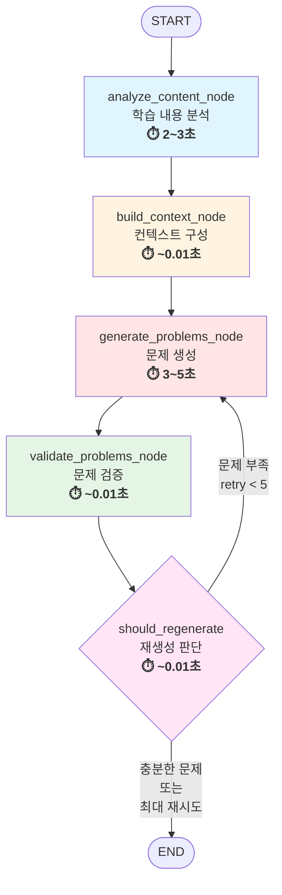

### 성능 지표

| 단계 | 평균 시간 | 주요 작업 | 비고 |
|------|---------|----------|------|
| **Analyze** | 2~3초 | LLM 토픽 추출 + ChromaDB 검색 | 토픽 제공시 ~0.2초 |
| **Build** | ~0.01초 | 라운드 로빈 컨텍스트 구성 | 빠른 텍스트 처리 |
| **Generate** | 3~5초 | Solar LLM 문제 생성 | 난이도/개수 영향 |
| **Validate** | ~0.01초 | 검증 로직 실행 | 빠른 규칙 검사 |
| **Decision** | ~0.01초 | 재생성 판단 | 조건 체크만 |
| **Total (1회)** | **5~8초** | 재시도 없이 성공 | |
| **Total (재시도)** | **10~25초** | 최대 5회 재시도 포함 | retry_count 영향 |

---

## State: ProblemState

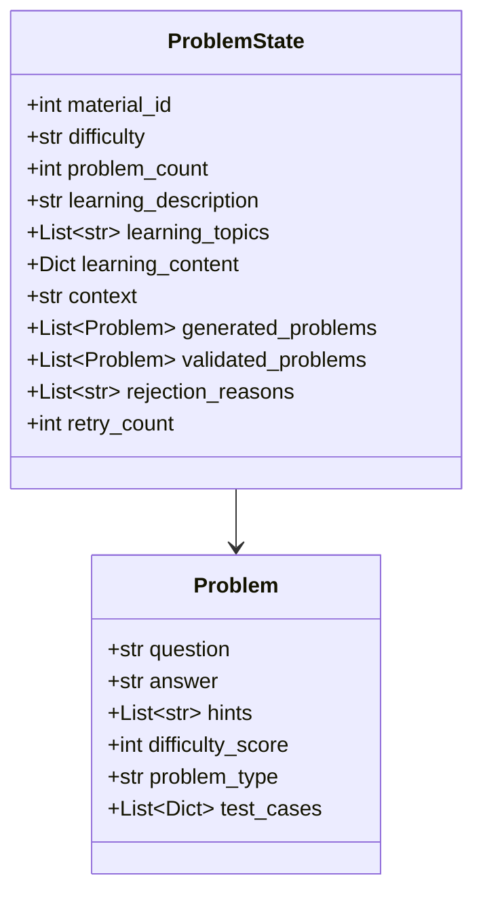

---

## 노드 1: analyze_content_node (⏱️ 2~3초)

### 학습 내용 분석

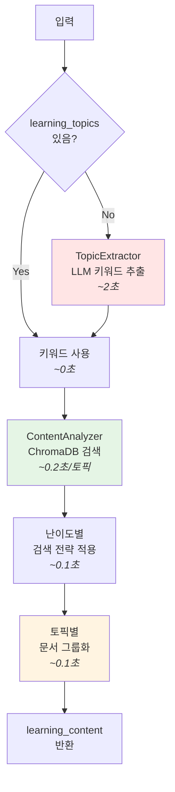

**세부 처리 단계**:
1. **토픽 추출** (~2초 or ~0초): LLM으로 키워드 추출 (이미 제공되면 스킵)
2. **ChromaDB 검색** (~0.2초/토픽): 각 토픽별로 관련 문서 검색
3. **난이도별 전략 적용** (~0.1초): BEGINNER 5개, INTERMEDIATE 7개, ADVANCED 10개
4. **문서 그룹화** (~0.1초): 토픽별로 검색 결과 정리

### 주제 추출 과정

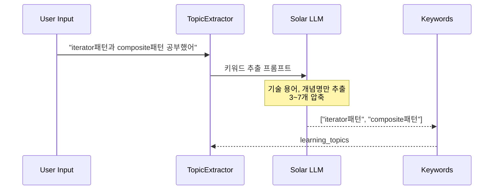

### 난이도별 검색 전략

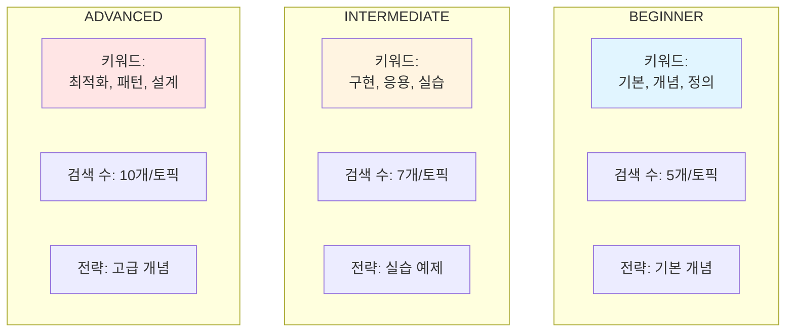

### 토픽별 문서 그룹화

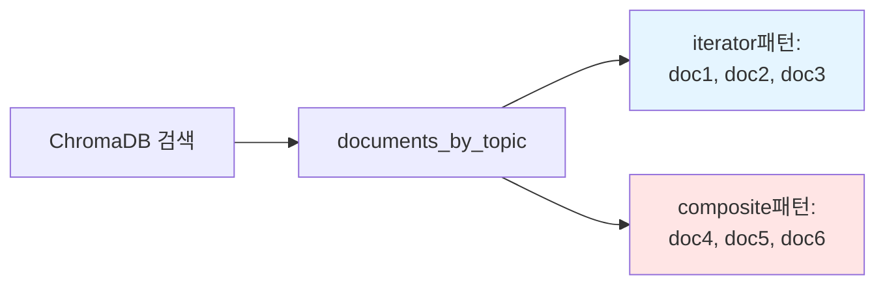

---

## 노드 2: build_context_node

### 라운드 로빈 방식 균등 분배

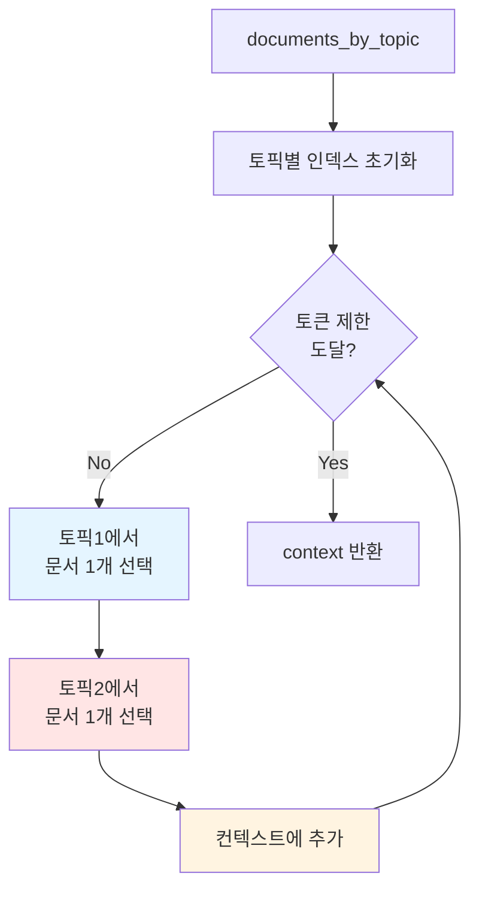

### 균등 분배 예시

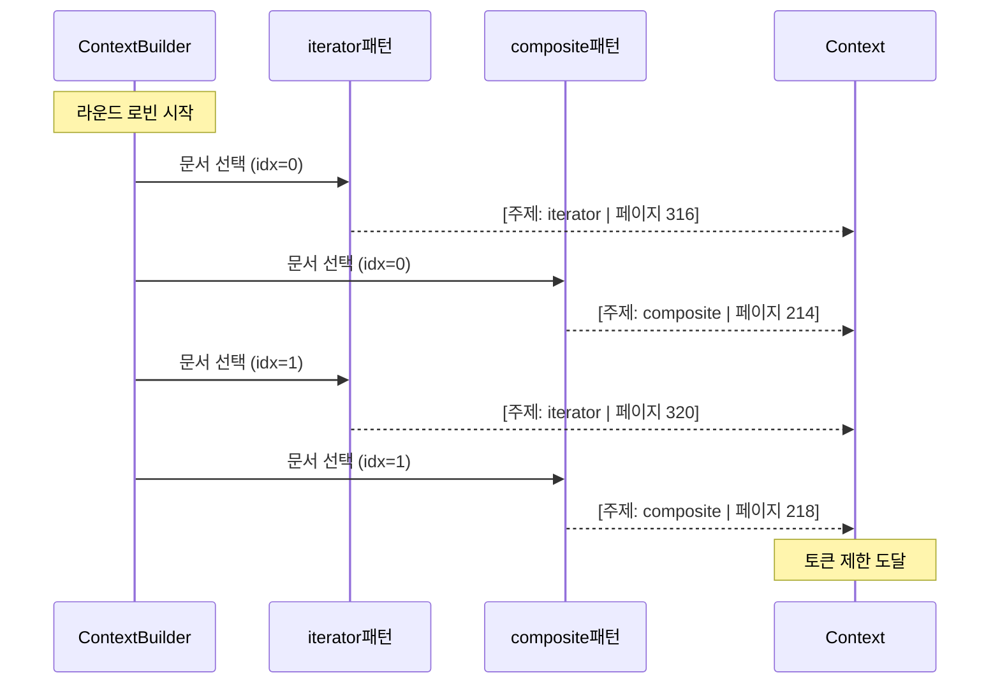

### 토픽 편향 방지

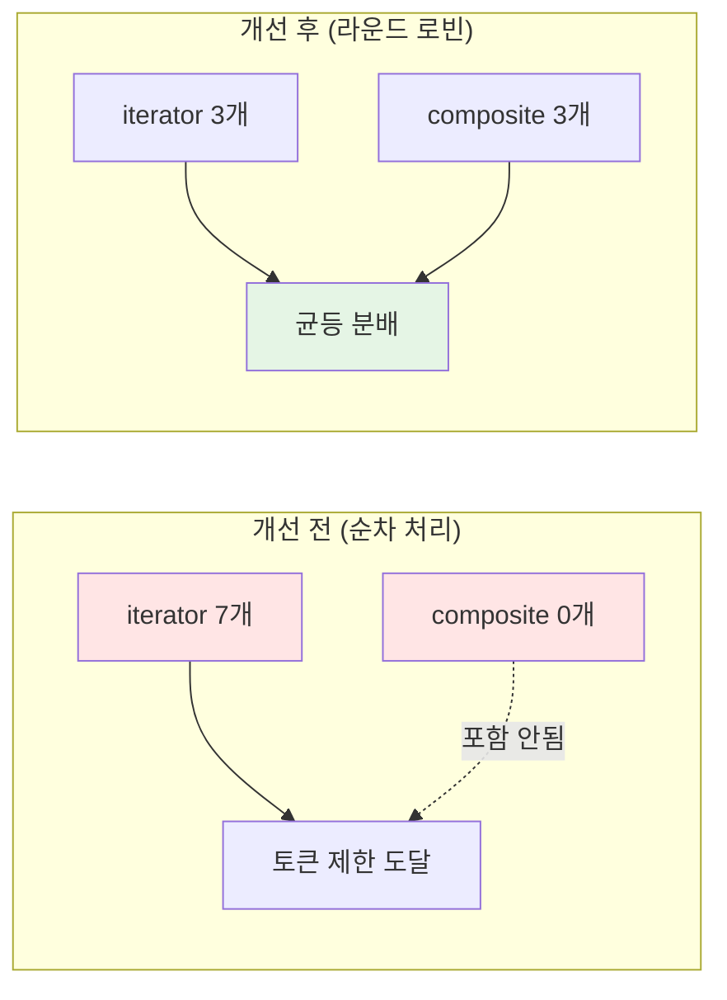

---

## 노드 3: generate_problems_node (⏱️ 3~5초)

### 난이도별 생성기 선택

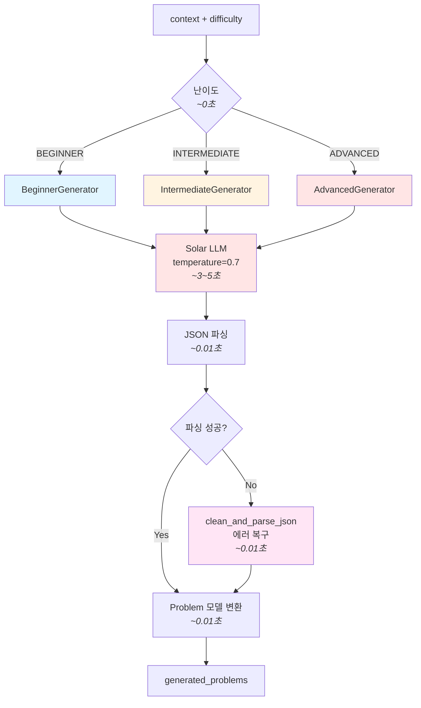

**세부 처리 단계**:
1. **Generator 선택** (~0초): 난이도에 따른 조건 분기
2. **프롬프트 구성** (~0.01초): 컨텍스트 + 난이도별 프롬프트 템플릿
3. **LLM 생성** (~3-5초): Solar-1-mini-chat으로 JSON 형태 문제 생성
4. **JSON 파싱** (~0.01초): 응답을 Python 딕셔너리로 변환 (에러 복구 포함)
5. **모델 변환** (~0.01초): Problem 모델 객체로 변환

### 난이도별 문제 유형

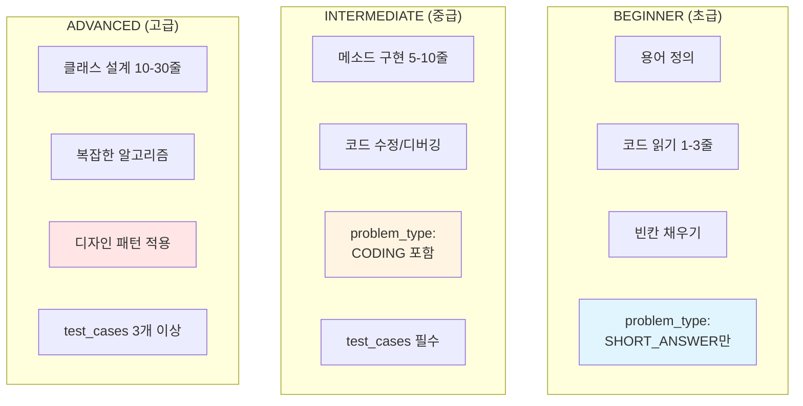

### 문제 생성 과정

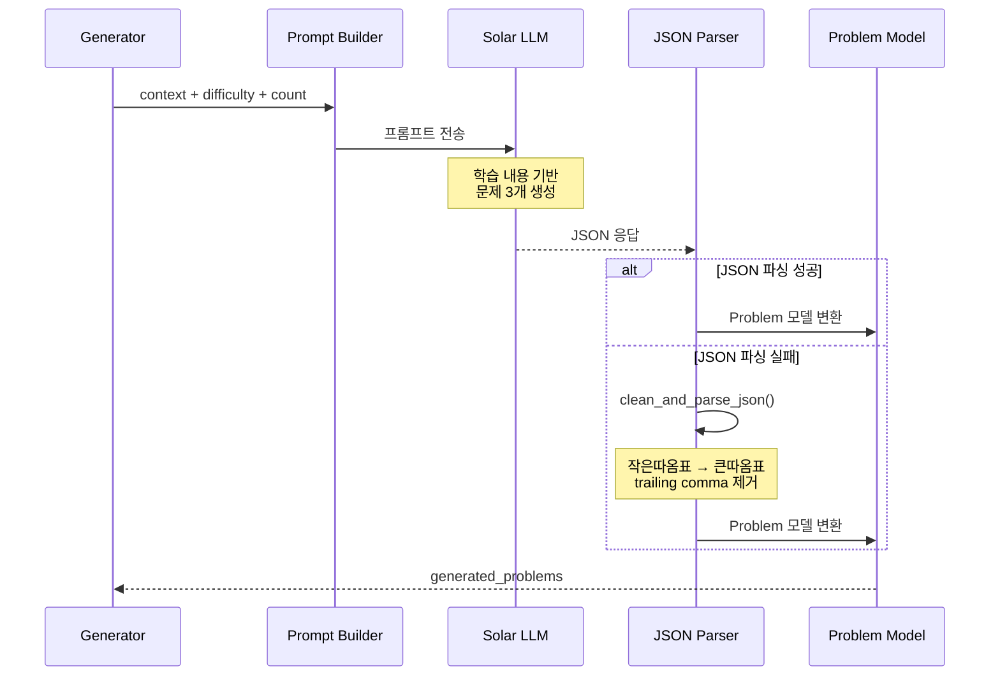

---

## 노드 4: validate_problems_node

### 검증 프로세스

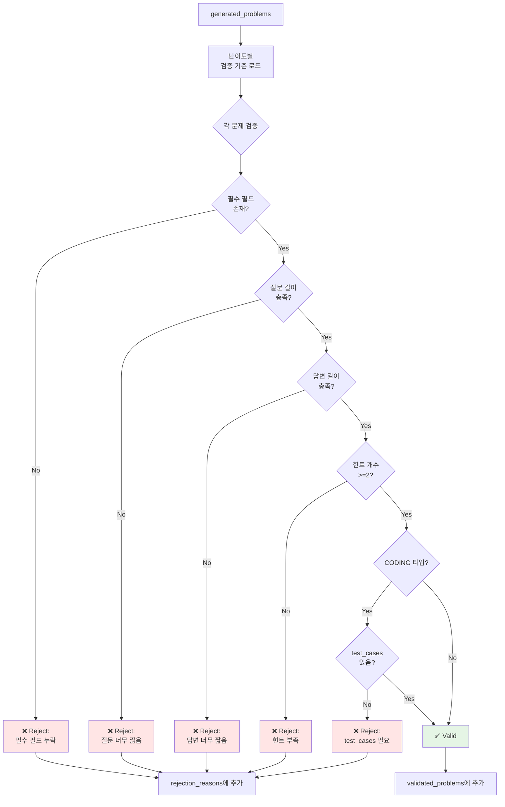

### 난이도별 검증 기준

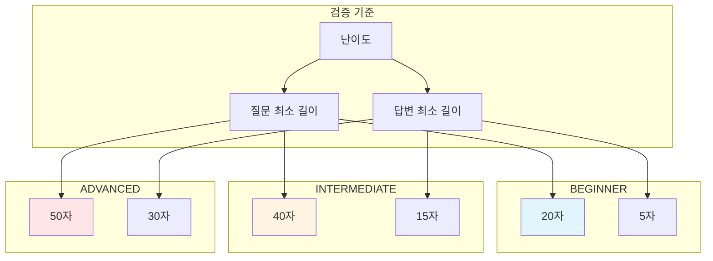

### 누적 검증 방식

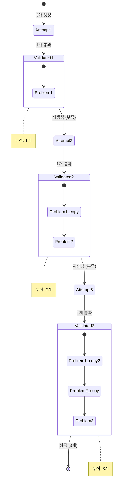

---

## 노드 5: should_regenerate (조건부 엣지)

### 재생성 판단 로직

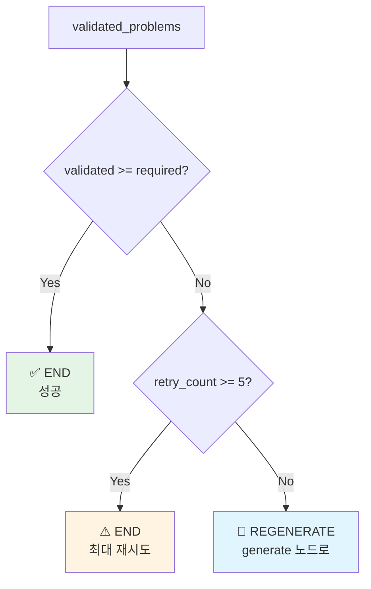

### 재생성 흐름 예시

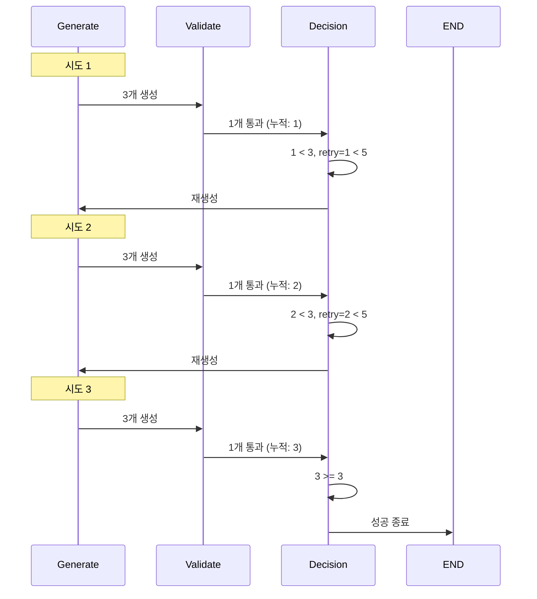

### 최대 재시도 예시

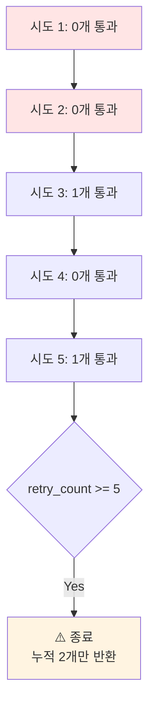

---

## 전체 시스템 아키텍처

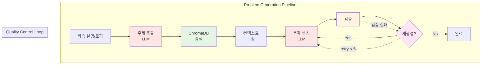

---

## 성능 최적화

### 토픽 균등 분배 효과

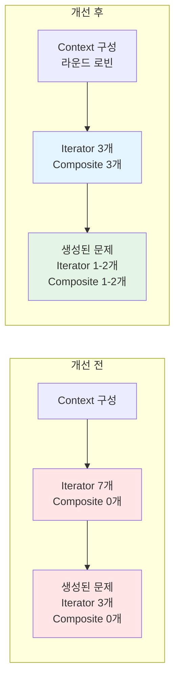

### 검증 기준 차등 효과

```mermaid
graph TB
    subgraph "개선 전 (동일 기준)"
        A1[모든 난이도<br/>질문 50자 이상]
        A1 --> A2[초급 용어 정의<br/>12자]
        A2 --> A3[❌ Reject]
        A3 --> A4[무한 재생성]
    end

    subgraph "개선 후 (차등 기준)"
        B1[BEGINNER: 20자<br/>INTERMEDIATE: 40자<br/>ADVANCED: 50자]
        B1 --> B2[초급 용어 정의<br/>25자]
        B2 --> B3[✅ Valid]
        B3 --> B4[성공 생성]
    end

    style A3 fill:#ffe5e5
    style A4 fill:#ffe5e5
    style B3 fill:#e5f5e5
    style B4 fill:#e5f5e5
```

---

## 데이터 흐름

```mermaid
stateDiagram-v2
    [*] --> Input: learning_description
    Input --> TopicExtract: "iterator패턴 공부"
    TopicExtract --> Search: ["iterator패턴"]
    Search --> Context: documents_by_topic
    Context --> Generate: context (2000자)
    Generate --> Validate: 3 problems

    state Validate {
        [*] --> Check1
        Check1 --> Check2
        Check2 --> [*]
    }

    Validate --> Decision: validated + rejected

    state Decision <<choice>>
    Decision --> Generate: retry < 5 && valid < required
    Decision --> [*]: valid >= required || retry >= 5

    note right of TopicExtract
        LLM 키워드 추출
    end note

    note right of Context
        라운드 로빈 분배
    end note

    note right of Validate
        난이도별 검증
    end note
```

---

## 컴포넌트 다이어그램

```mermaid
graph TB
    subgraph "External Services"
        US[Upstage API<br/>- Solar LLM<br/>- Embedding]
        CH[ChromaDB<br/>Vector Store]
    end

    subgraph "paper_problem Module"
        WF[workflow.py<br/>LangGraph]
        GEN[generators/<br/>beginner.py<br/>intermediate.py<br/>advanced.py]
        UTL[utils/<br/>topic_extractor.py<br/>content_analyzer.py<br/>context_builder.py]
        VAL[validators/<br/>problem_validator.py]
        API[api.py<br/>FastAPI Routes]
    end

    subgraph "shared Module"
        UC[upstage_client.py]
        CC[chroma_client.py]
    end

    API --> WF
    WF --> GEN
    WF --> UTL
    WF --> VAL
    GEN --> UC
    UTL --> UC
    UTL --> CC
    UC --> US
    CC --> CH

    style US fill:#ffe5e5
    style CH fill:#e5f5e5
    style WF fill:#fff4e1
    style GEN fill:#e1f5ff
```
