# QA System - LangGraph Workflow

RAG 기반 질의응답 시스템의 LangGraph 워크플로우

---

## Upload Workflow

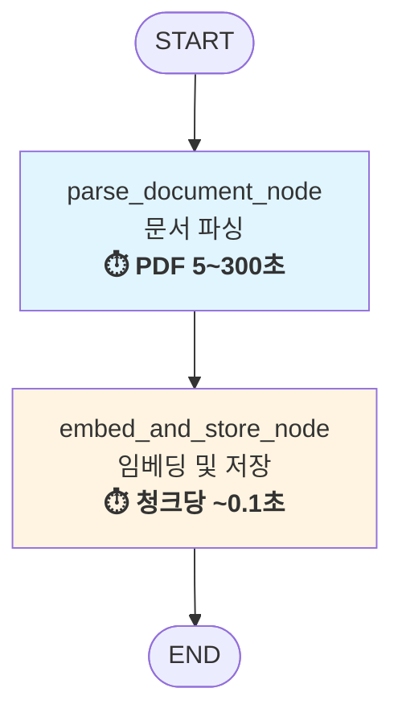

### 성능 지표

| 단계 | 소요 시간 | 주요 작업 | 예시 (554페이지 PDF) |
|------|---------|----------|---------------------|
| **Parse** | 5~300초 | Upstage Document Parse API | ~300초 |
| **Embed & Store** | 청크당 ~0.1초 | 임베딩 생성 + ChromaDB 저장 | 2,700청크 × 0.1초 = ~270초 |
| **Total** | **문서 크기 의존** | 파싱 + 임베딩 + 저장 | **~570초 (9.5분)** |

**최적화 포인트**:
- 배치 임베딩으로 API 호출 최소화 (텍스트 배열 한 번에 전송)
- ChromaDB 배치 저장 (BATCH_SIZE=100)으로 HTTP 요청 27회로 감소

### State: UploadState

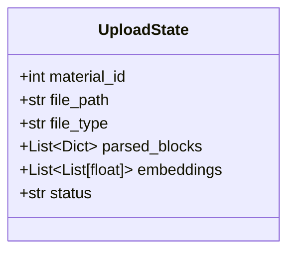

### parse_document_node

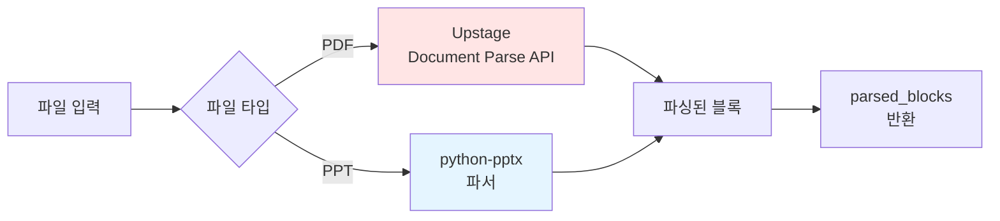

### embed_and_store_node (⏱️ 청크당 ~0.1초)

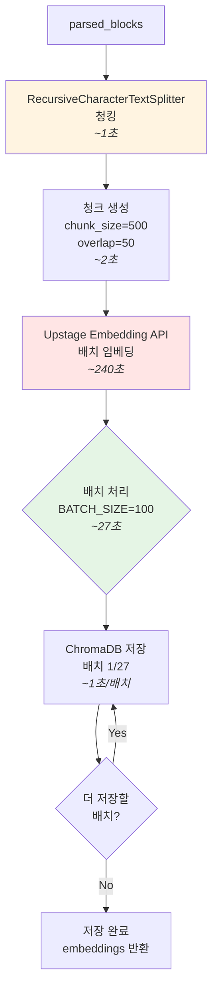

**세부 처리 단계** (554페이지 PDF 기준):
1. **텍스트 분할** (~3초): 554개 블록을 2,700개 청크로 분할
2. **임베딩 생성** (~240초): Upstage API로 2,700개 청크 → 4096차원 벡터 변환
3. **배치 저장** (~27초): ChromaDB에 100개씩 27회 저장 (페이로드 제한 회피)
4. **Total**: **~270초 (4.5분)**

#### 청킹 상세

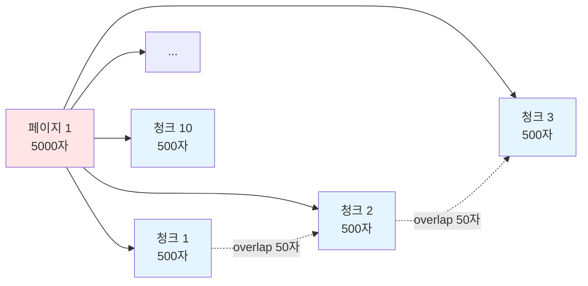

#### 배치 처리 상세

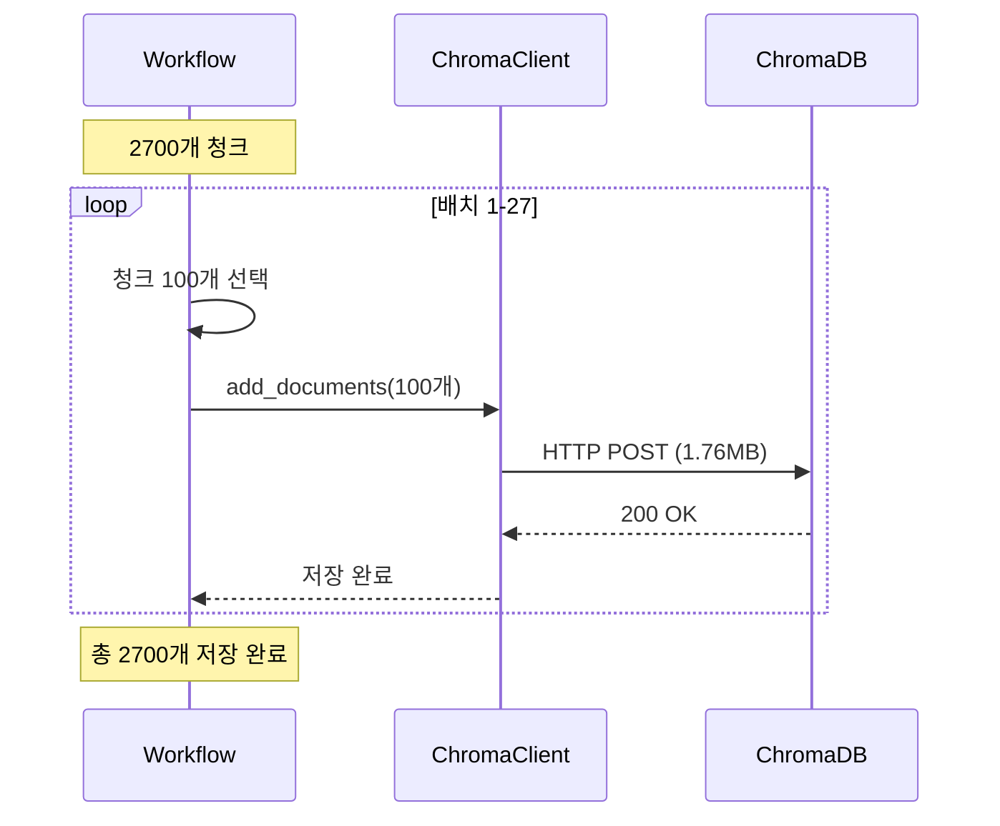

---

## QA Workflow

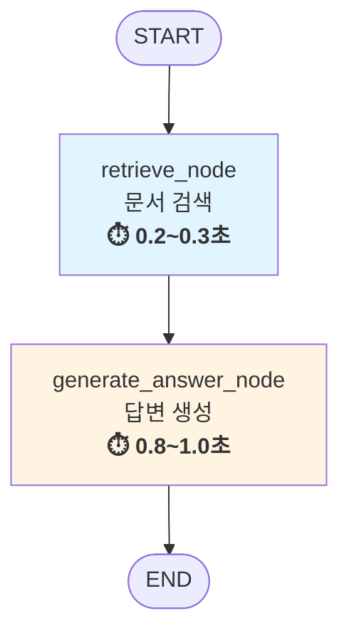

### 성능 지표

| 단계 | 평균 시간 | 주요 작업 |
|------|---------|----------|
| **Retrieve** | 0.2~0.3초 | 질문 임베딩 + ChromaDB 검색 (k=3) |
| **Generate** | 0.8~1.0초 | 컨텍스트 구성 + Solar LLM 응답 생성 |
| **Total** | **1.0~1.3초** | 전체 QA 응답 시간 |

### State: QAState

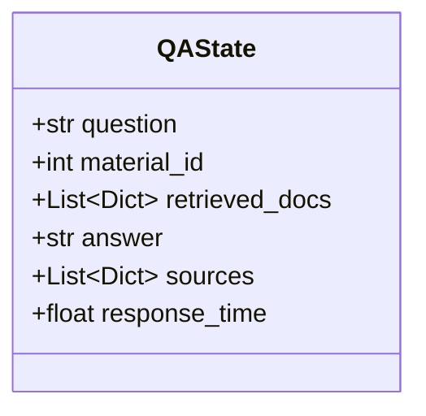

### retrieve_node (⏱️ 0.2~0.3초)

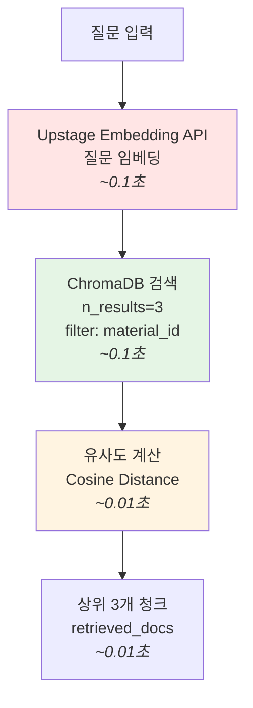

**세부 처리 단계**:
1. **질문 임베딩 생성** (~0.1초): Upstage API를 통해 4096차원 벡터 생성
2. **벡터 유사도 검색** (~0.1초): ChromaDB에서 코사인 거리 기반 검색
3. **결과 필터링** (~0.01초): material_id로 필터링, 상위 3개 선택
4. **응답 구성** (~0.01초): 문서 내용, 페이지, 메타데이터 포맷팅

#### 검색 과정

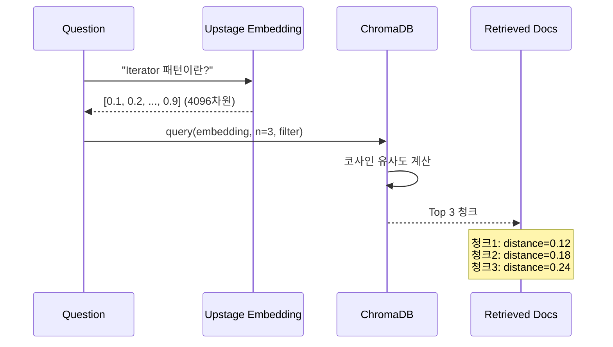

### generate_answer_node (⏱️ 0.8~1.0초)

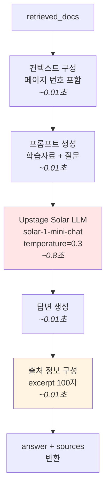

**세부 처리 단계**:
1. **컨텍스트 구성** (~0.01초): 검색된 3개 청크를 페이지 번호와 함께 포맷팅
2. **프롬프트 빌드** (~0.01초): 시스템 프롬프트 + 컨텍스트 + 질문 결합
3. **LLM 응답 생성** (~0.8초): Solar-1-mini-chat 모델로 답변 생성 (가장 긴 단계)
4. **후처리** (~0.02초): 답변 텍스트 추출 및 출처 정보 구성

#### 답변 생성 과정

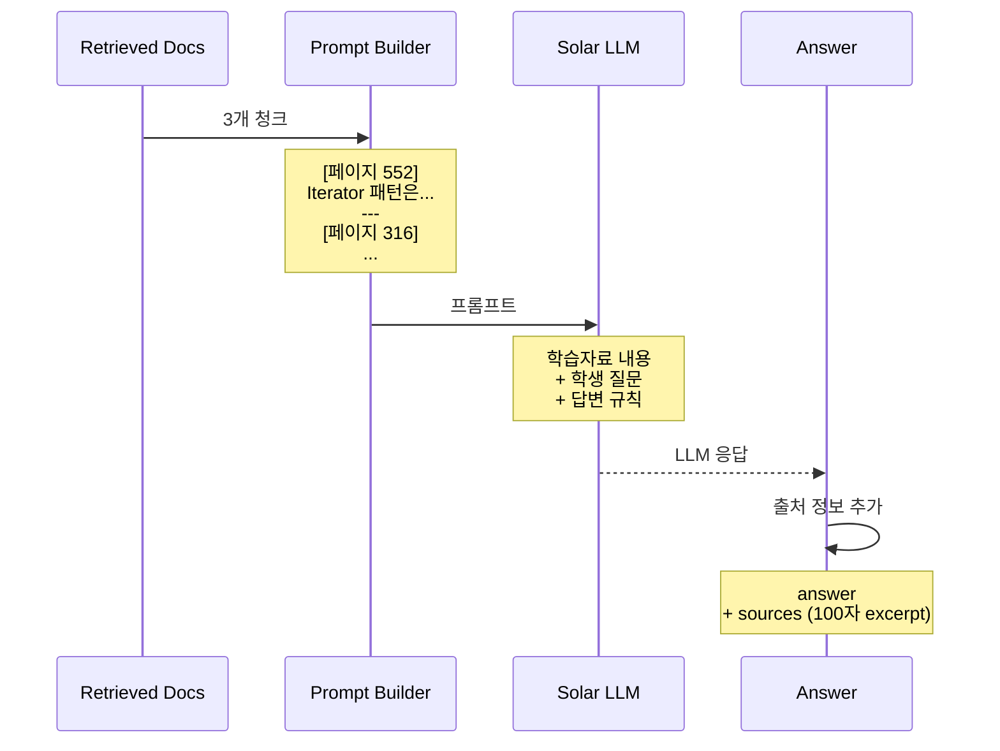

---

## 전체 시스템 아키텍처

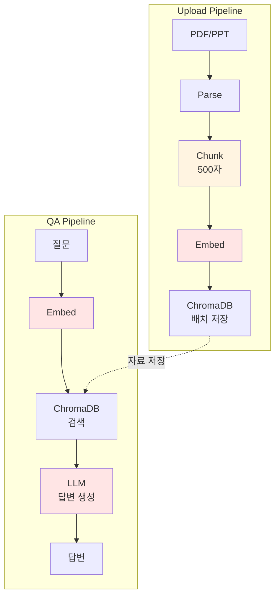

---

## 성능 최적화

### 청킹 전략 비교

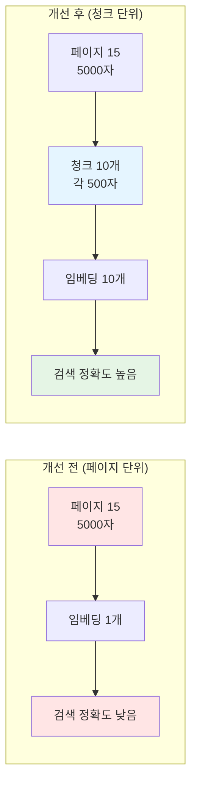

### 배치 처리 효과

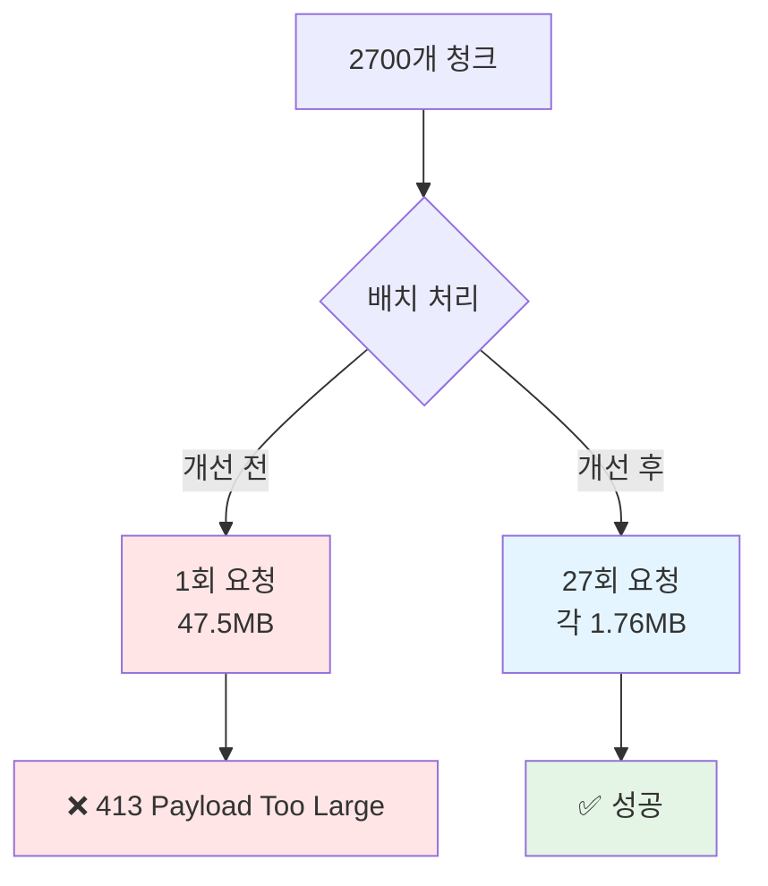

---

## 데이터 흐름

### Upload Flow

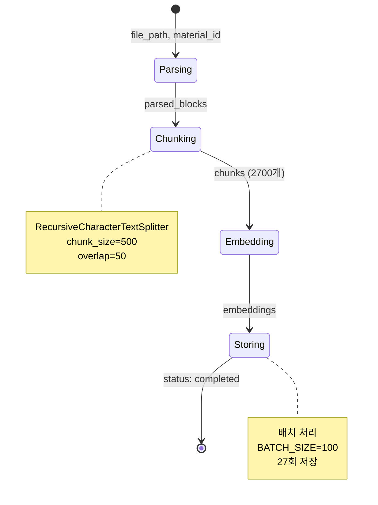

### QA Flow

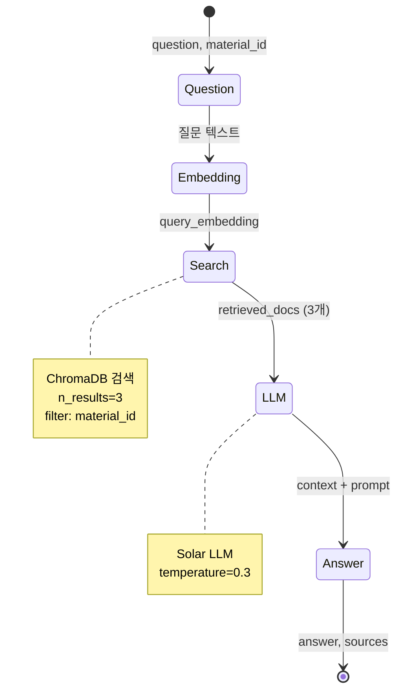

---

## 컴포넌트 다이어그램

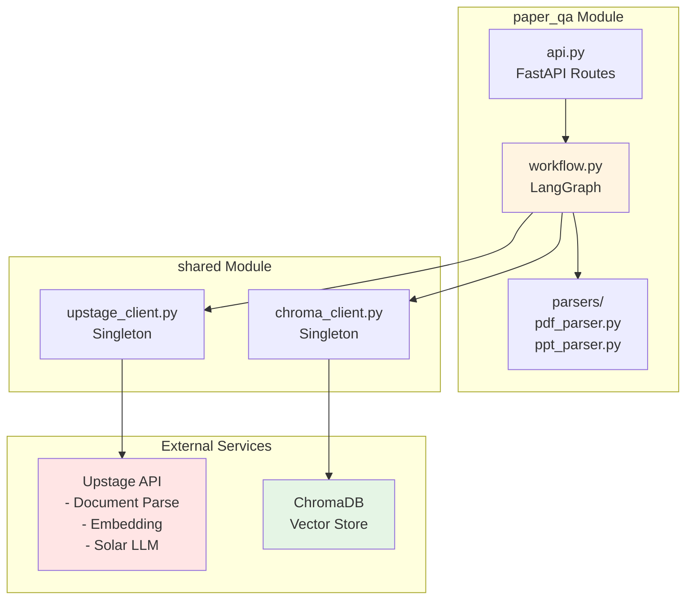
