# QA System - LangGraph Workflow

RAG 기반 질의응답 시스템의 LangGraph 워크플로우

---

## Upload Workflow

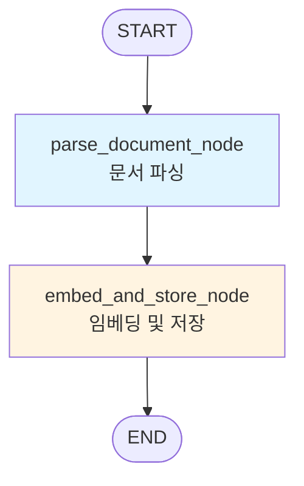

### State: UploadState

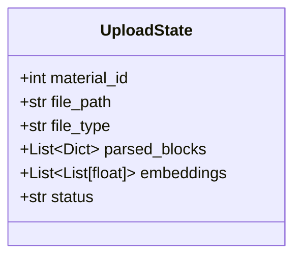

### parse_document_node

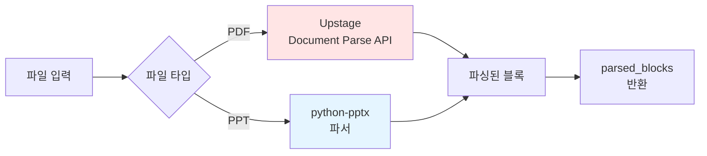

### embed_and_store_node

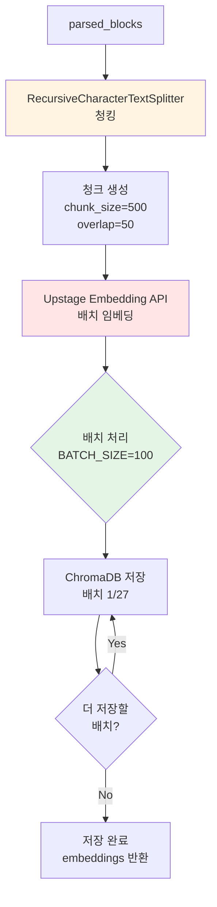

#### 청킹 상세

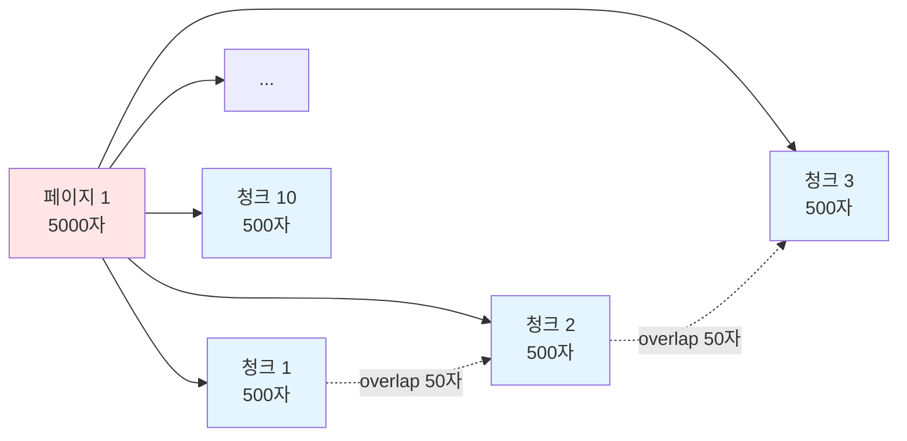

#### 배치 처리 상세

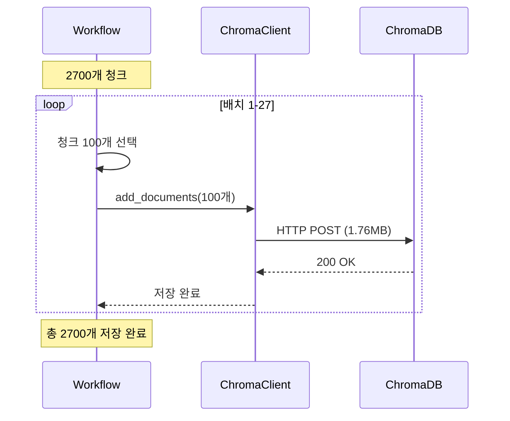

---

## QA Workflow

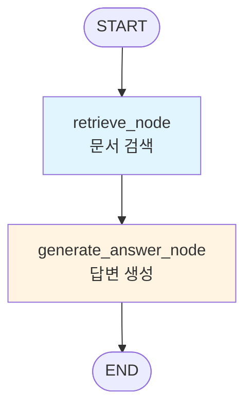

### State: QAState

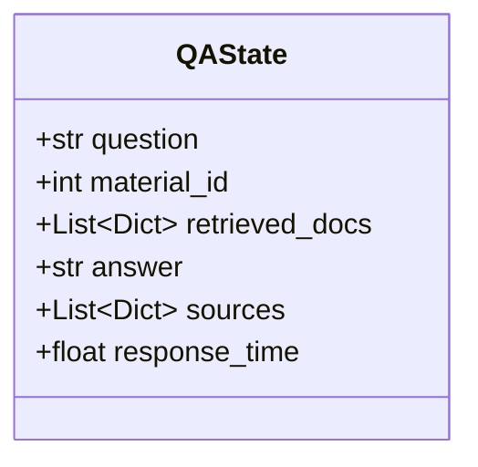

### retrieve_node

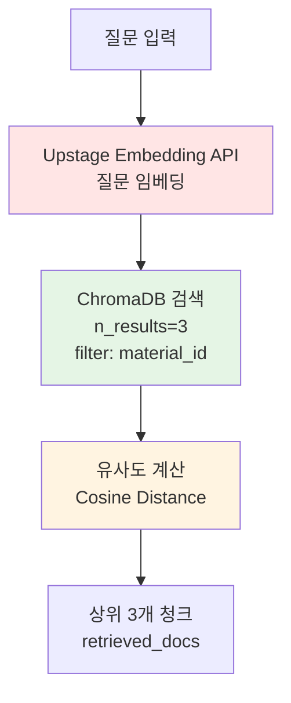

#### 검색 과정

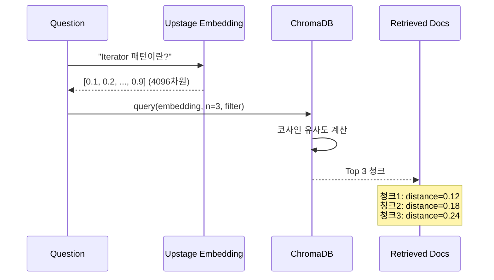

### generate_answer_node

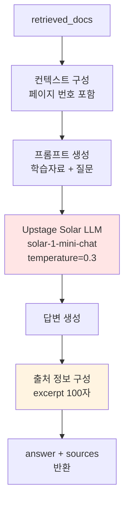

#### 답변 생성 과정

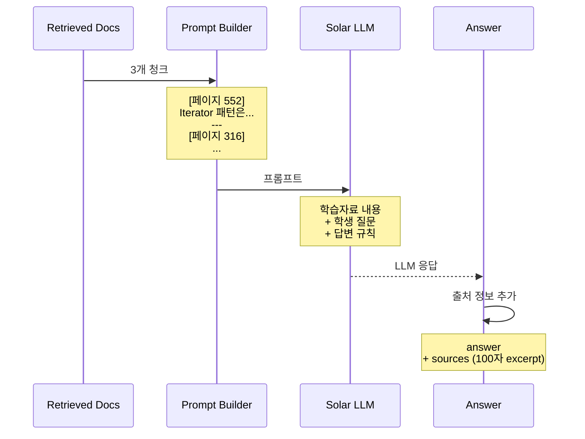

---

## 전체 시스템 아키텍처

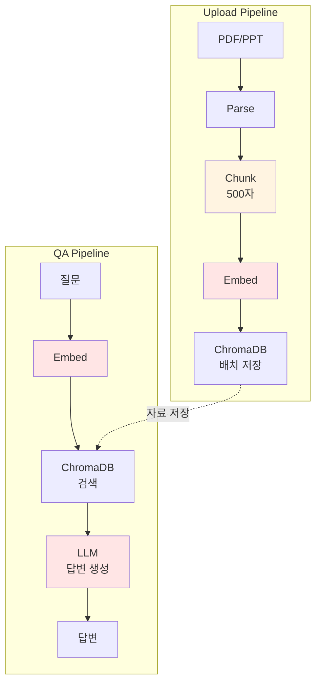

---

## 성능 최적화

### 청킹 전략 비교

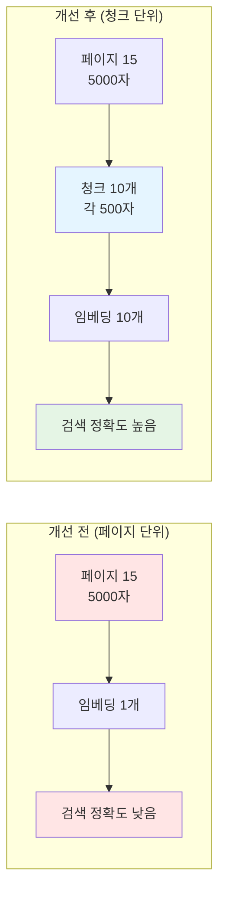

### 배치 처리 효과

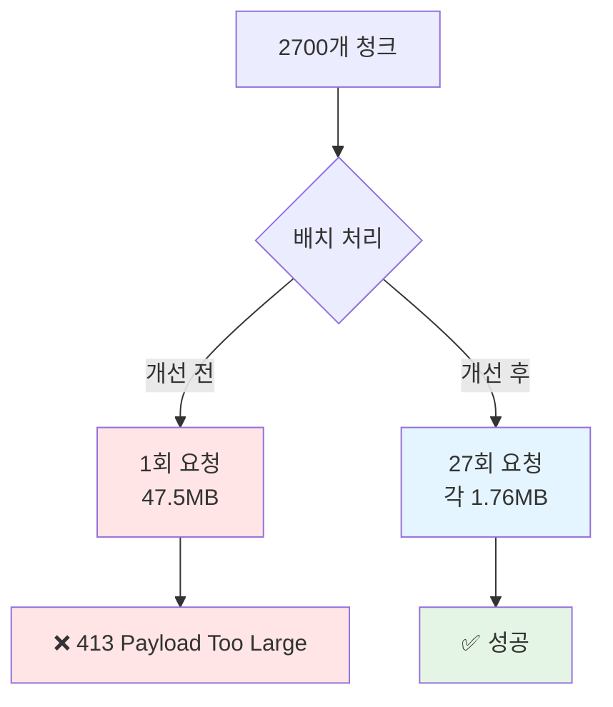

---

## 데이터 흐름

### Upload Flow

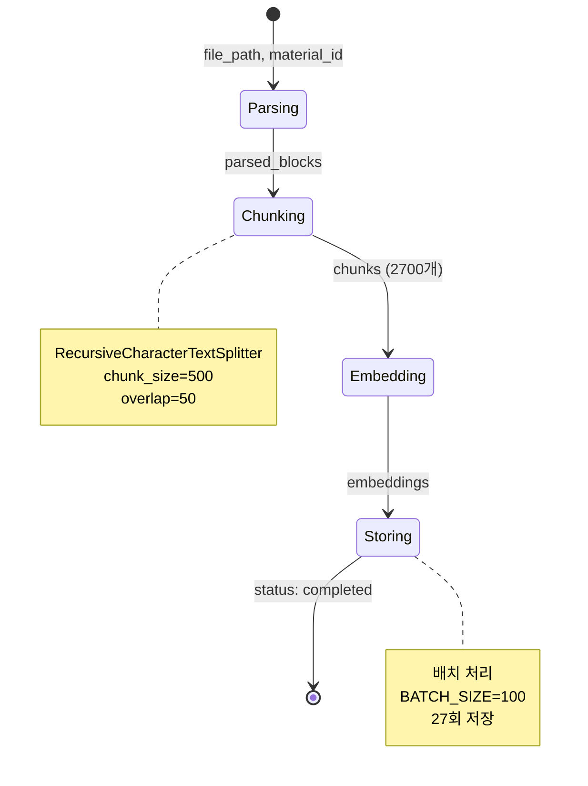

### QA Flow

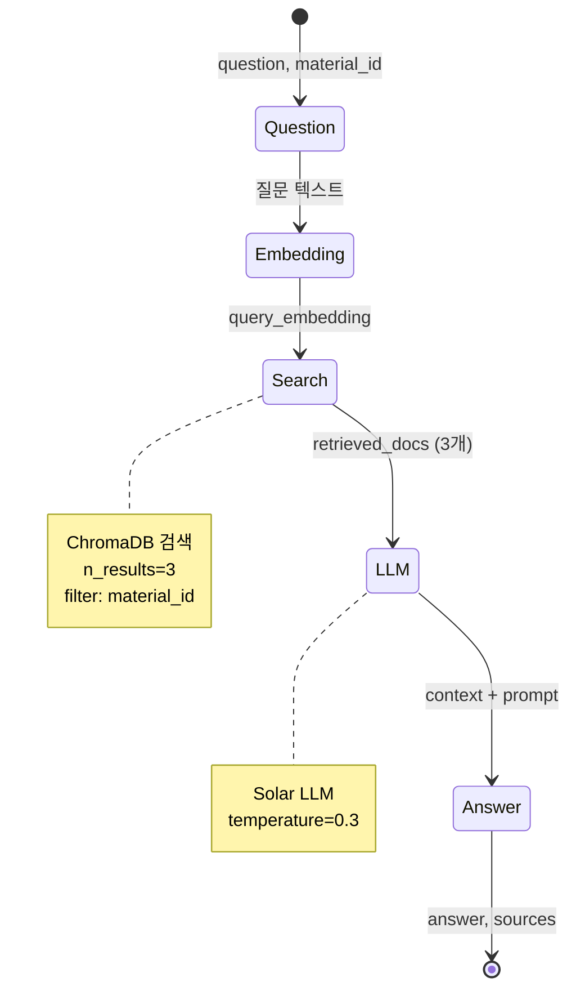

---

## 컴포넌트 다이어그램

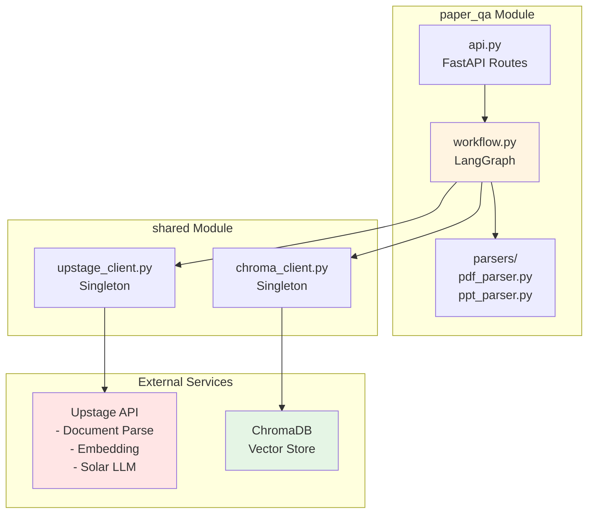
