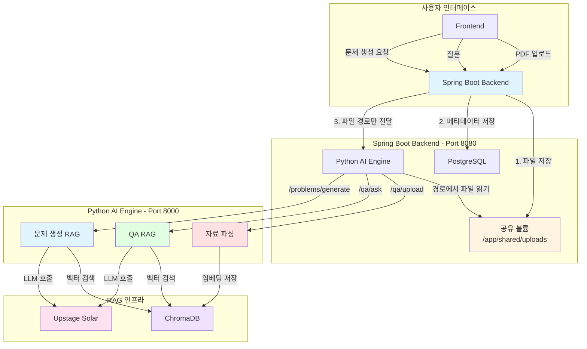
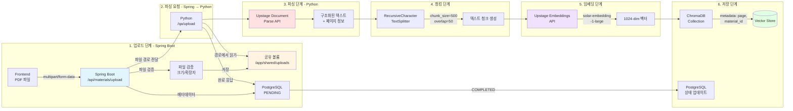
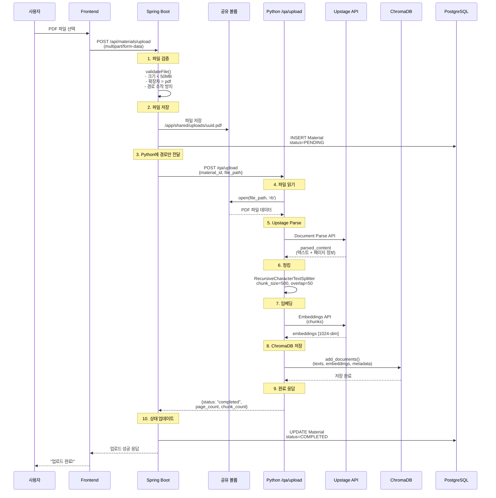
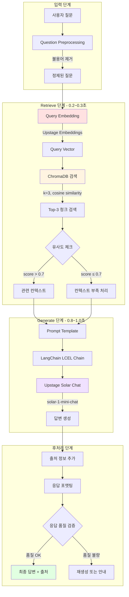
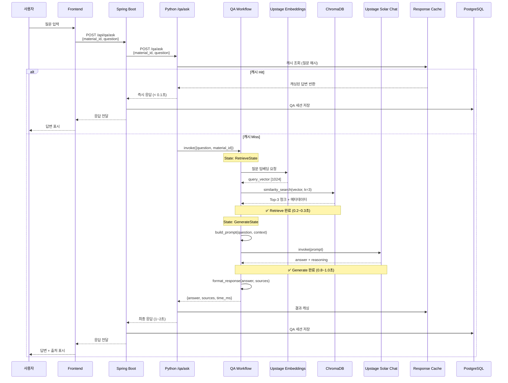
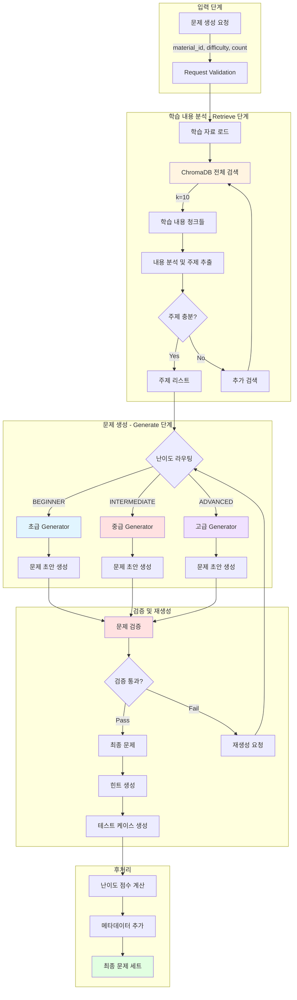
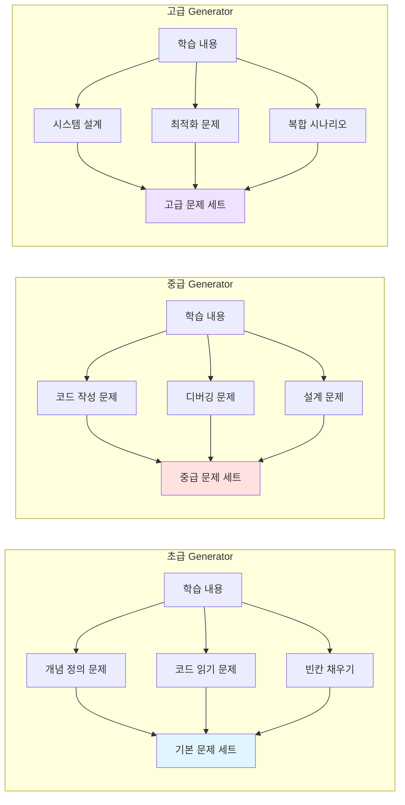
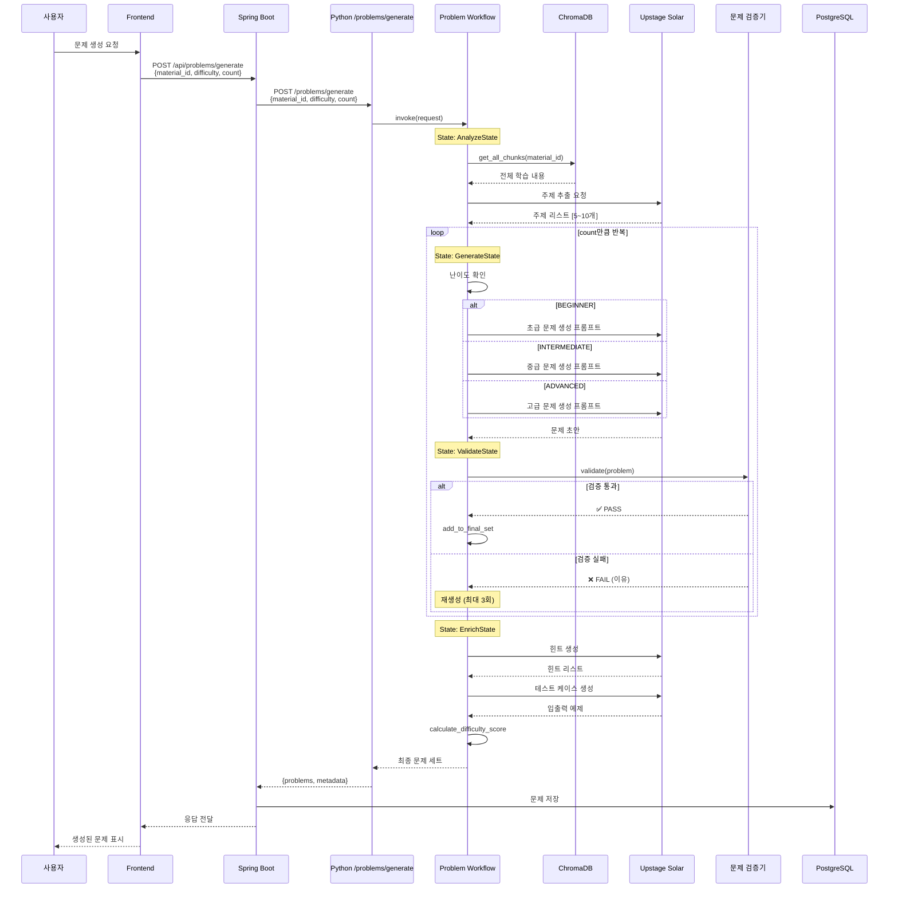
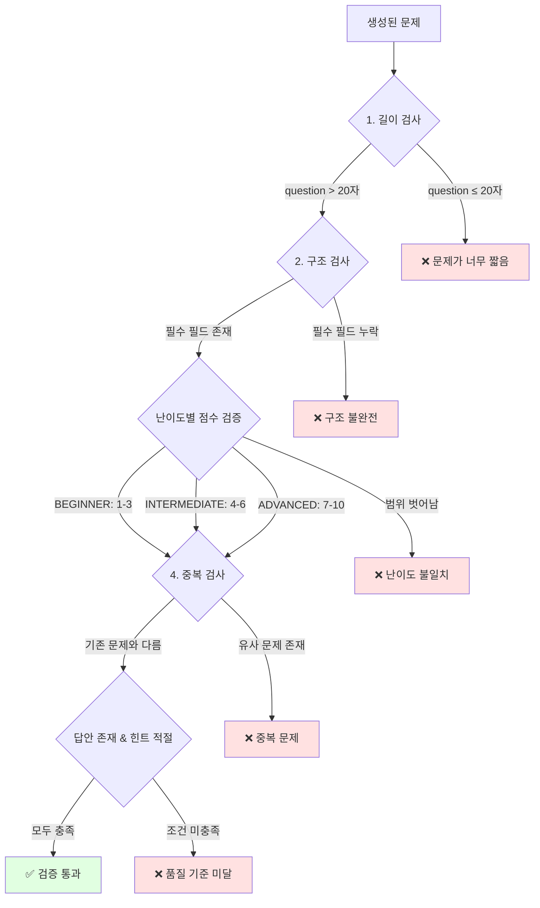
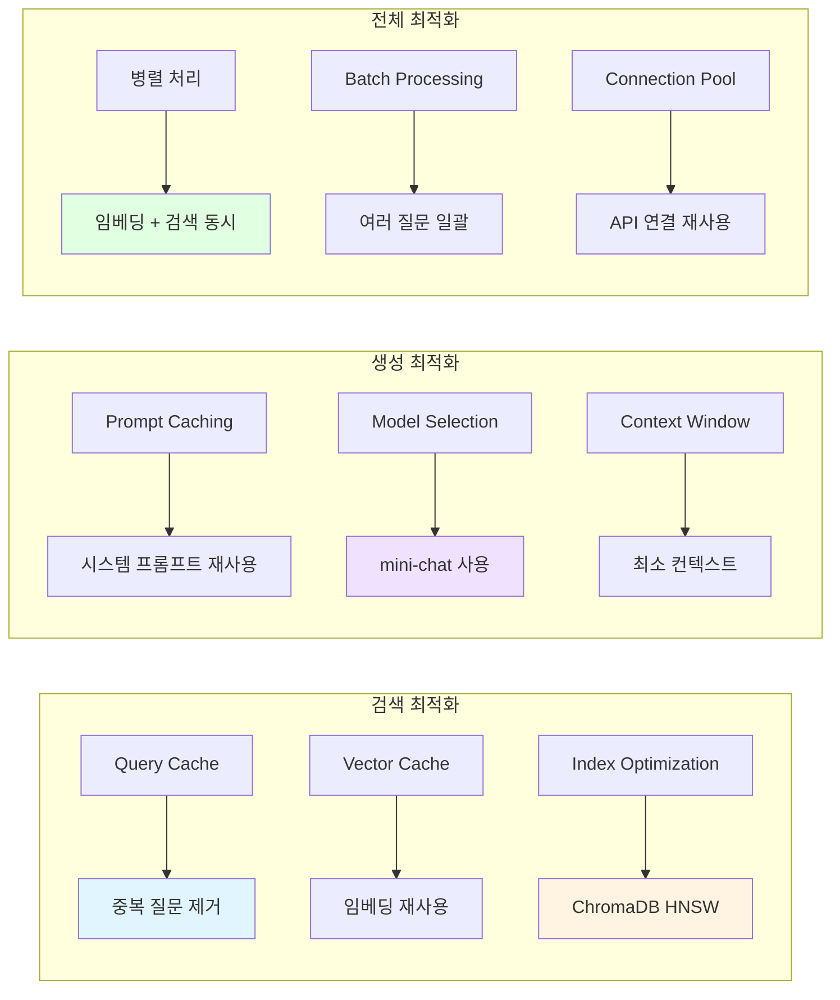

# RAG 파이프라인 다이어그램

**프로젝트**: EduMentor AI
**목적**: 팀별 RAG 파이프라인 상세 구조 및 데이터 흐름
**작성일**: 2025-10-28

---

## 📋 목차

1. [전체 시스템 RAG 아키텍처](#전체-시스템-rag-아키텍처)
2. [팀1 QA 시스템 RAG 파이프라인](#팀1-qa-시스템-rag-파이프라인)
3. [팀2 문제 생성 RAG 파이프라인](#팀2-문제-생성-rag-파이프라인)
4. [성능 최적화 전략](#성능-최적화-전략)

---

## 🏗️ 전체 시스템 RAG 아키텍처

### 시스템 전체 흐름 (최적화된 파일 업로드)



**핵심 최적화**:
- ✨ 파일은 Frontend → Spring Boot로 1회만 전송
- ✨ Spring Boot가 공유 볼륨에 저장
- ✨ Python은 파일 경로만 받아 직접 읽기 (네트워크 전송 X)

---

## 📚 팀1: QA 시스템 RAG 파이프라인

### 1. 자료 업로드 및 파싱 파이프라인 (최적화)



**주요 구성 요소**:

| 단계 | 담당 | 도구 | 설정 | 목적 |
|------|------|------|------|------|
| **파일 수신** | Spring Boot | FileStorageService | 50MB 제한, PDF만 | 파일 검증 및 저장 |
| **경로 전달** | Spring Boot | WebClient | 파일 경로만 | 네트워크 최적화 |
| **파싱** | Python | Upstage Document Parse | API v1 | PDF 구조 분석 |
| **청킹** | Python | RecursiveCharacterTextSplitter | size=500, overlap=50 | 의미 단위 분할 |
| **임베딩** | Python | Upstage Embeddings | solar-embedding-1-large | 1024차원 벡터화 |
| **저장** | Python | ChromaDB | cosine similarity | 벡터 검색 |

### 1-1. 자료 업로드 상세 데이터 흐름 (Sequence Diagram)



**성능 지표**:
- **파일 전송**: Frontend → Spring Boot (3초, 10MB 기준)
- **파일 저장**: Spring Boot → 공유 볼륨 (< 0.5초)
- **경로 전달**: Spring Boot → Python (< 0.1초) ✨ 최적화!
- **파싱**: Upstage Document Parse (3~5초)
- **청킹 + 임베딩**: 2~3초
- **ChromaDB 저장**: 1~2초
- **총 소요 시간**: 약 8~10초 (50MB PDF 기준)

**기존 대비 개선**:
- 파일 전송 2회 → 1회 (27% 속도 향상)
- 네트워크 부하 50% 감소

### 2. QA RAG 파이프라인 (1-2초 응답)



### 3. QA RAG 상세 데이터 흐름



**성능 지표**:
- **Retrieve**: 0.2~0.3초 (ChromaDB 벡터 검색)
- **Generate**: 0.8~1.0초 (LLM 응답 생성)
- **Total**: 1.0~1.3초 (캐싱 없을 때)
- **Cached**: < 0.1초 (동일 질문 반복 시)

### 4. QA 프롬프트 템플릿

```python
QA_PROMPT_TEMPLATE = """
당신은 학습 자료 기반 QA 전문가입니다.

**컨텍스트**:
{context}

**질문**: {question}

**지침**:
1. 제공된 컨텍스트만을 사용하여 답변하세요
2. 컨텍스트에 없는 내용은 "제공된 자료에서 찾을 수 없습니다"라고 명확히 하세요
3. 답변은 명확하고 구체적으로 작성하세요
4. 가능하면 예제나 코드를 포함하세요
5. 출처를 명시하세요 (페이지 번호 등)

**답변**:
"""
```

---

## 🎯 팀2: 문제 생성 RAG 파이프라인

### 1. 문제 생성 전체 파이프라인



### 2. 난이도별 Generator 상세



### 3. 문제 생성 Workflow (LangGraph)



### 4. 문제 검증 로직



**검증 기준**:

| 검증 항목 | 기준 | 실패 시 처리 |
|-----------|------|--------------|
| **최소 길이** | question > 20자 | 재생성 |
| **필수 필드** | question, answer, hints 존재 | 재생성 |
| **난이도 점수** | 초급:1-3, 중급:4-6, 고급:7-10 | 재생성 |
| **중복 검사** | 기존 문제와 유사도 < 0.8 | 재생성 |
| **품질 검사** | 답안 완성도, 힌트 유용성 | 재생성 |

### 5. 난이도별 프롬프트 템플릿

#### 초급 (BEGINNER)

```python
BEGINNER_PROMPT = """
**학습 내용**: {context}
**주제**: {topic}

초급 학습자를 위한 기본 개념 확인 문제를 생성하세요.

**문제 유형**:
1. 개념 정의 (이 용어의 의미는?)
2. 코드 읽기 (이 코드의 실행 결과는?)
3. 빈칸 채우기 (다음 코드의 빈칸을 채우세요)

**요구사항**:
- 난이도 점수: 1-3
- 학습 내용에 직접 명시된 내용만 사용
- 명확한 정답 존재
- 3개의 힌트 제공
- 간단한 코드 예제 포함 (선택)

출력 형식: JSON
{
  "question": "문제 내용",
  "answer": "정답",
  "hints": ["힌트1", "힌트2", "힌트3"],
  "difficulty_score": 2,
  "problem_type": "CONCEPT"
}
"""
```

#### 중급 (INTERMEDIATE)

```python
INTERMEDIATE_PROMPT = """
**학습 내용**: {context}
**주제**: {topic}

중급 학습자를 위한 응용 문제를 생성하세요.

**문제 유형**:
1. 코드 작성 (특정 기능 구현)
2. 디버깅 (오류가 있는 코드 수정)
3. 설계 (간단한 시스템 설계)

**요구사항**:
- 난이도 점수: 4-6
- 학습 내용을 바탕으로 응용
- 여러 개념 통합
- 단계별 힌트 제공
- 테스트 케이스 포함

출력 형식: JSON
{
  "question": "문제 내용 (상황 설명)",
  "answer": "완전한 답안 코드",
  "hints": ["힌트1", "힌트2", "힌트3", "힌트4"],
  "difficulty_score": 5,
  "problem_type": "CODING",
  "test_cases": [
    {"input": "...", "expected": "..."},
    {"input": "...", "expected": "..."}
  ]
}
"""
```

#### 고급 (ADVANCED)

```python
ADVANCED_PROMPT = """
**학습 내용**: {context}
**주제**: {topic}

고급 학습자를 위한 심화 문제를 생성하세요.

**문제 유형**:
1. 시스템 설계 (아키텍처 설계)
2. 최적화 (성능 개선)
3. 복합 시나리오 (실무 상황 해결)

**요구사항**:
- 난이도 점수: 7-10
- 여러 주제 통합
- 설계 및 구현 모두 요구
- Trade-off 고려 필요
- 확장성 및 성능 고려
- 상세한 테스트 케이스

출력 형식: JSON
{
  "question": "복합 시나리오 문제",
  "answer": "설계 + 구현 + 설명",
  "hints": ["힌트1", "힌트2", "힌트3", "힌트4", "힌트5"],
  "difficulty_score": 8,
  "problem_type": "SYSTEM_DESIGN",
  "test_cases": [
    {"scenario": "...", "expected": "..."},
    {"scenario": "...", "expected": "..."}
  ],
  "evaluation_criteria": ["확장성", "성능", "코드 품질"]
}
"""
```

---

## ⚡ 성능 최적화 전략

### 1. QA 시스템 최적화



**목표 성능**:
- **QA 응답**: < 2초 (95 percentile)
- **문제 생성**: < 30초 (3문제 기준)
- **자료 파싱**: < 10초 (10페이지 PDF)

### 2. 문제 생성 최적화

| 최적화 기법 | 방법 | 효과 |
|-------------|------|------|
| **병렬 생성** | 여러 문제 동시 생성 | 3배 속도 향상 |
| **재생성 제한** | 최대 3회 재시도 | 무한 루프 방지 |
| **주제 캐싱** | 학습 내용 분석 재사용 | 50% 시간 절약 |
| **템플릿 최적화** | 명확한 지시사항 | 재생성률 감소 |

### 3. ChromaDB 최적화

```yaml
# chromadb 설정
collection_metadata:
  hnsw:space: "cosine"
  hnsw:construction_ef: 200
  hnsw:search_ef: 100
  hnsw:M: 16

# 인덱싱 전략
- 자료별 별도 컬렉션
- 주기적 인덱스 재구성
- 메모리 캐싱 활성화
```

---

## 📊 데이터 흐름 요약

### 자료 업로드 시스템 (최적화)

```
사용자 (PDF 선택)
    ↓
Frontend (파일 전송)
    ↓
Spring Boot (파일 검증 + 공유 볼륨 저장) - 3초
    ↓
Spring Boot → Python (파일 경로만 전달) - < 0.1초 ✨
    ↓
Python (경로에서 파일 읽기)
    ↓
Upstage Document Parse - 3~5초
    ↓
청킹 + 임베딩 - 2~3초
    ↓
ChromaDB 저장 - 1~2초
    ↓
PostgreSQL 상태 업데이트
    ↓
사용자 (업로드 완료, 총 8~10초)
```

### QA 시스템

```
사용자 질문
    ↓
Frontend → Spring Boot → Python - < 0.1초
    ↓
질문 임베딩 (0.1초)
    ↓
ChromaDB 검색 (0.2초)
    ↓
프롬프트 구성 (0.1초)
    ↓
LLM 생성 (0.8초)
    ↓
Python → Spring Boot (DB 저장) → Frontend
    ↓
답변 + 출처 (총 1.2초)
```

### 문제 생성 시스템

```
생성 요청
    ↓
Frontend → Spring Boot → Python
    ↓
학습 내용 로드 (1초)
    ↓
주제 분석 (3초)
    ↓
문제 생성 (각 5초 × 3 = 15초)
    ↓
검증 + 힌트 생성 (5초)
    ↓
Python → Spring Boot (DB 저장) → Frontend
    ↓
최종 문제 세트 (총 24초)
```

---

## 🔗 관련 문서

- [팀1_QA시스템_구현가이드.md](./팀1_QA시스템_구현가이드.md)
- [팀2_문제생성_구현가이드.md](./팀2_문제생성_구현가이드.md)
- [전체_시스템_아키텍처.md](./전체_시스템_아키텍처.md)
- [Python_통합_구현가이드.md](./Python_통합_구현가이드.md)
- [파일업로드_최적화_구현가이드.md](OLD_파일업로드_최적화_구현가이드.md) - ✨ 파일 업로드 최적화 상세

---

**작성일**: 2025-10-28
**최종 수정**: 2025-10-28 (Spring Boot 플로우 반영, PPT 제거, 최적화 추가)
