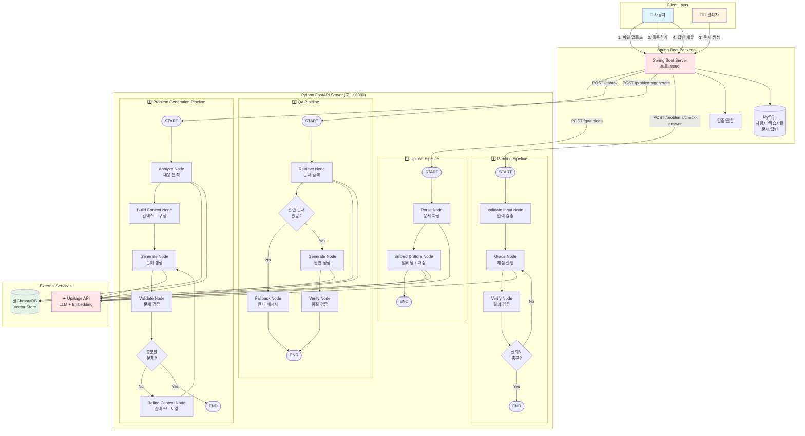
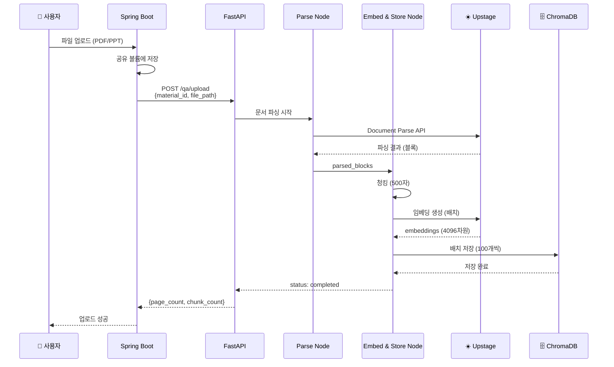
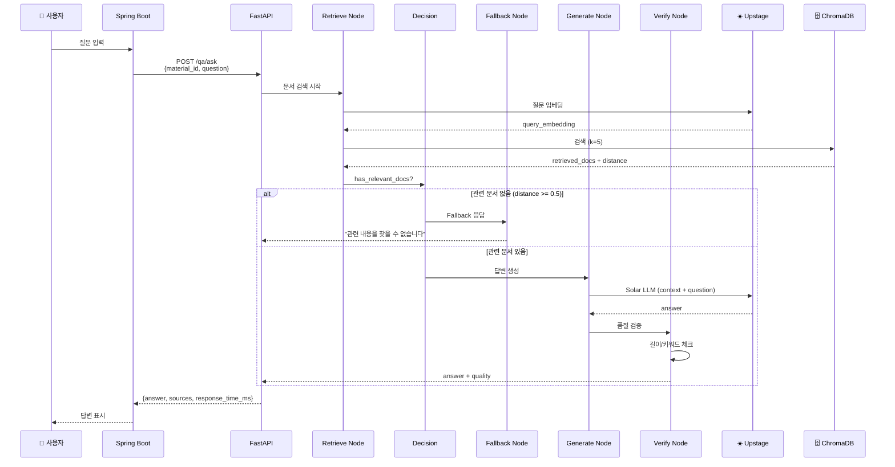
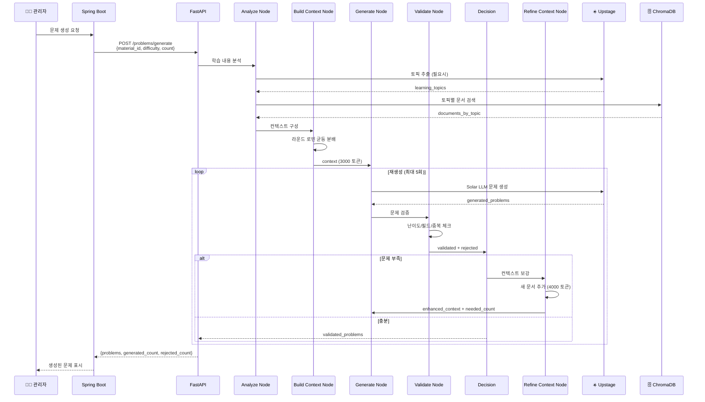
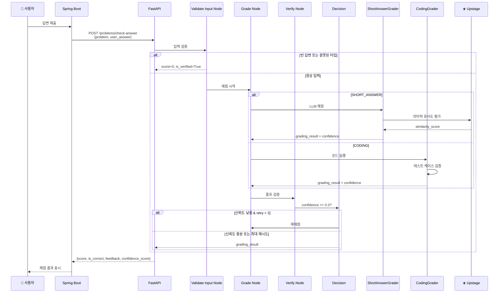
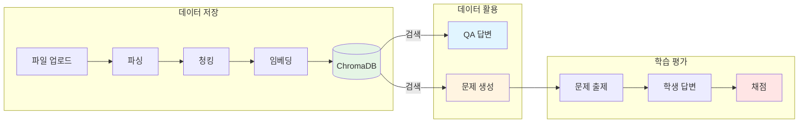
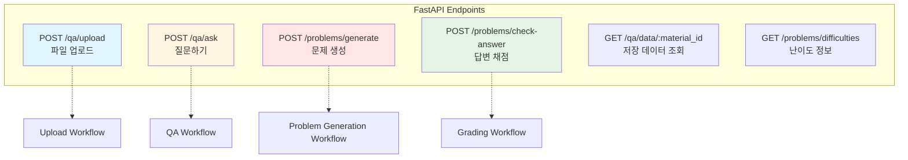
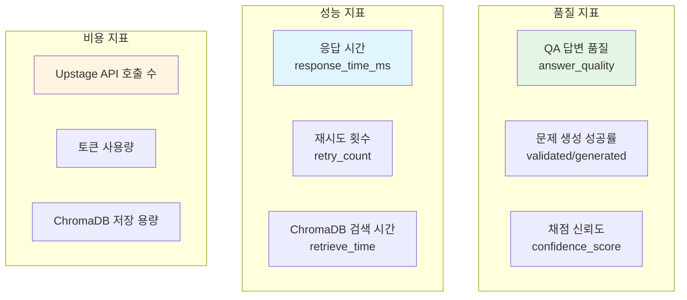

# EduMentor AI - 전체 시스템 아키텍처

Python FastAPI 서버의 4가지 LangGraph 워크플로우를 포함한 전체 시스템 흐름도

---

## 시스템 전체 아키텍처

---

## 워크플로우별 상세 흐름

### 1️⃣ Upload Pipeline (파일 업로드 → 벡터 저장)

**소요 시간**: 5~10분 (문서 크기 의존)

---

### 2️⃣ QA Pipeline (질문 → 답변 생성)

**소요 시간**: 1.0~1.5초 (normal) / 0.2~0.3초 (fallback)

---

### 3️⃣ Problem Generation Pipeline (문제 자동 생성)

**소요 시간**: 13~20초 (재생성 시 +7초/회)

---

### 4️⃣ Grading Pipeline (답변 채점)

**소요 시간**: 0.5~2.5초 (재채점 시 +0.5초)

---

## 데이터 흐름 요약

---

## 시스템 구성 요소

### Python FastAPI Server

| 모듈 | 역할 | 주요 파일 |
|------|------|----------|
| **paper_qa** | QA 시스템 | `workflow.py`, `api.py` |
| **paper_problem** | 문제 생성/채점 | `workflow.py`, `grading_workflow.py`, `api.py` |
| **shared** | 공유 클라이언트 | `upstage_client.py`, `chroma_client.py` |

### External Services

| 서비스 | 용도 | 연결 |
|--------|------|------|
| **Upstage API** | LLM + Embedding + 문서파싱 | Solar-1-mini-chat, Embedding API |
| **ChromaDB** | Vector Database | localhost:8001 |
| **Spring Boot** | 백엔드 서버 | localhost:8080 |

---

## API 엔드포인트 맵

---

## 성능 특성

### 응답 시간

| 워크플로우 | 초기 실행 | 재시도 포함 | 병목 구간 |
|-----------|---------|-----------|----------|
| Upload | 5~10분 | N/A | Upstage Document Parse (5~300초) |
| QA | 1.0~1.5초 | N/A | Solar LLM 생성 (0.8초) |
| Problem Generation | 13초 | 13~20초 | Solar LLM 생성 (8초) |
| Grading | 0.7초 | 0.7~2.5초 | LLM 채점 (0.5초) / 코드 실행 (2초) |

### 토큰 사용량 (추정)

| 워크플로우 | Input 토큰 | Output 토큰 | 비고 |
|-----------|-----------|------------|------|
| Upload | ~500K | ~100K | 554페이지 PDF 기준 |
| QA | ~1K | ~200 | 컨텍스트 3000자 + 답변 |
| Problem Generation | ~3K | ~1K | 문제 3개 생성 기준 |
| Grading | ~500 | ~300 | LLM 채점 기준 |

---

## 확장성 및 개선 방향

### 현재 구현
- ✅ 조건부 분기를 통한 품질 관리
- ✅ 재시도 로직으로 안정성 확보
- ✅ 배치 처리로 효율성 향상

### 향후 개선 가능 사항
- 🔄 캐싱 계층 추가 (Redis)
- 🔄 병렬 문제 생성 (여러 난이도 동시)
- 🔄 실시간 피드백 (WebSocket)
- 🔄 A/B 테스트 (프롬프트 최적화)

---

## 모니터링 포인트

