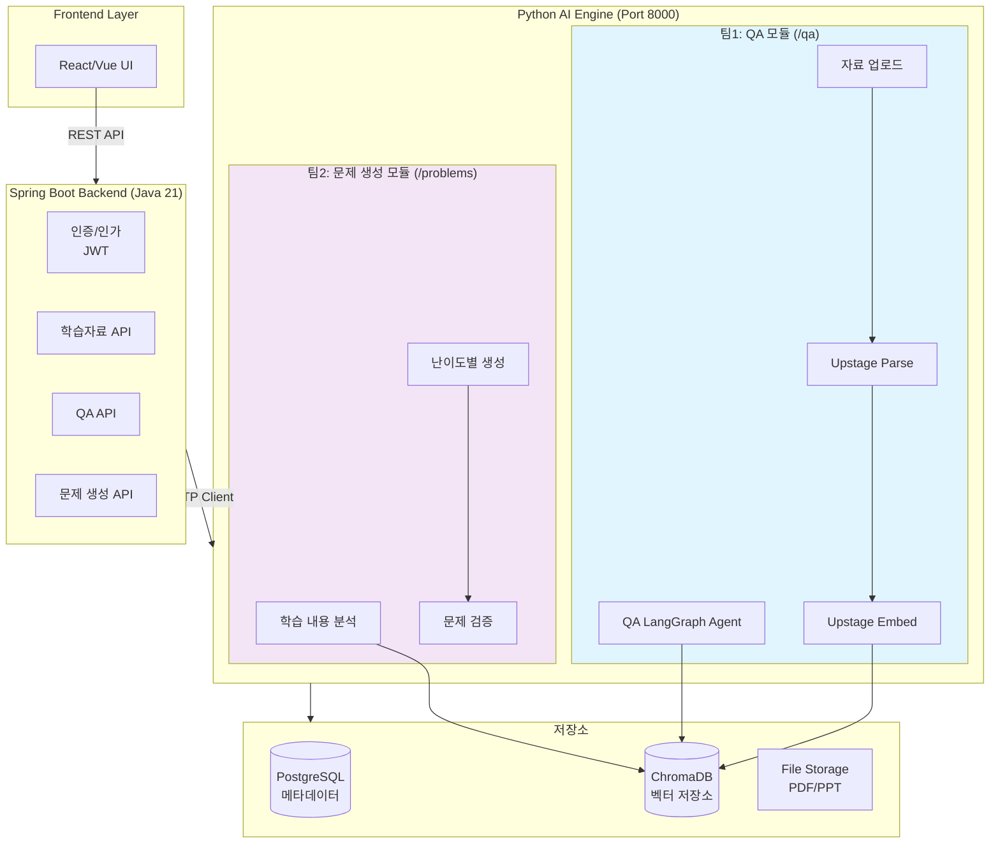
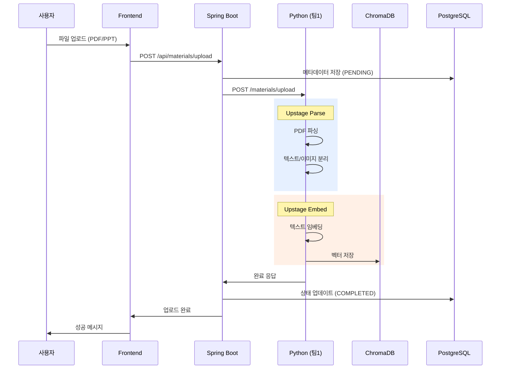
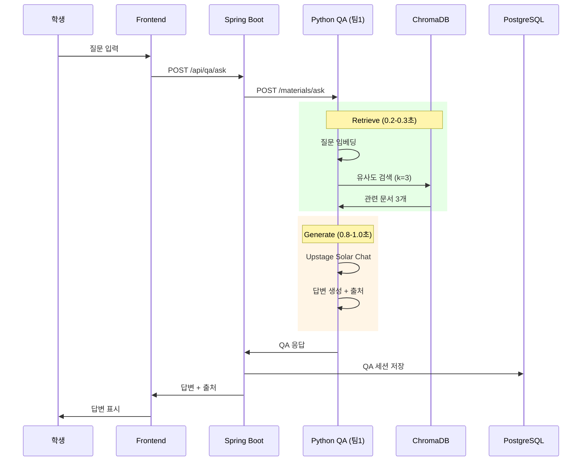
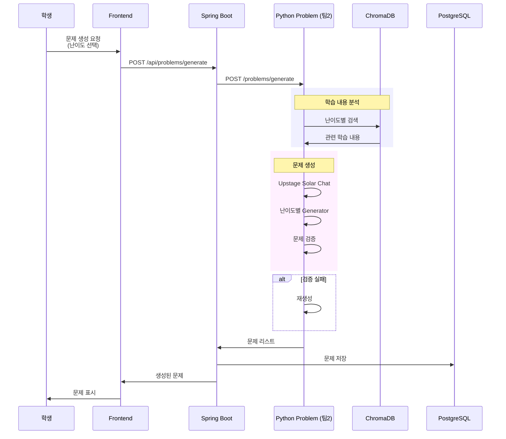

# EduMentor AI - 전체 시스템 아키텍처

**프로젝트**: 학습자료 기반 QA 및 난이도별 실습 문제 생성
**기간**: 2주
**팀 구성**: 4명 (팀1: QA 2명, 팀2: 문제생성 2명)

---

## 📊 시스템 개요



---

## 🔧 기술 스택

### Frontend
- **Framework**: React 18 또는 Vue 3
- **상태 관리**: Redux Toolkit / Vuex
- **HTTP 클라이언트**: Axios
- **UI 라이브러리**: Material-UI / Ant Design

### Backend (Spring Boot)
- **Java**: Java 21
- **Framework**: Spring Boot 3.2.0
- **Database**: PostgreSQL 15
- **ORM**: Spring Data JPA
- **Security**: Spring Security + JWT
- **HTTP Client**: WebClient (WebFlux)

### AI Engine (Python)
- **Framework**: FastAPI
- **LLM**: Upstage Solar API
- **Orchestration**: LangChain + LangGraph
- **Vector DB**: ChromaDB
- **PDF/PPT**: PyMuPDF, python-pptx

### Infrastructure
- **Container**: Docker + Docker Compose
- **Reverse Proxy**: Nginx (선택사항)
- **Monitoring**: Prometheus + Grafana (선택사항)

---

## 📁 프로젝트 구조

```
EduMentor/
├── frontend/                    # React/Vue 프론트엔드
│   ├── src/
│   │   ├── components/
│   │   ├── pages/
│   │   ├── services/
│   │   └── App.js
│   └── package.json
│
├── spring-backend/              # Spring Boot (Java 21)
│   ├── src/main/java/com/edumentor/
│   │   ├── config/
│   │   ├── domain/
│   │   ├── client/
│   │   ├── controller/
│   │   └── EduMentorApplication.java
│   ├── build.gradle
│   └── settings.gradle
│
├── python-server/               # Python AI Engine (단일 서버, Port 8000)
│   ├── main.py                  # FastAPI 메인
│   ├── config.py                # 공통 설정
│   ├── team1_qa/                # 팀1: QA 모듈 (/qa)
│   │   ├── workflow.py
│   │   ├── api.py
│   │   ├── parsers/
│   │   └── models.py
│   ├── team2_problem/           # 팀2: 문제 생성 모듈 (/problems)
│   │   ├── workflow.py
│   │   ├── api.py
│   │   ├── generators/
│   │   ├── validators/
│   │   └── models.py
│   ├── shared/                  # 공통 모듈 (팀1+팀2 공유)
│   │   ├── chroma_client.py
│   │   └── upstage_client.py
│   └── requirements.txt
│
├── docker/                      # Docker 설정
│   ├── docker-compose.yml
│   ├── postgres/
│   └── chromadb/
│
└── docs/                        # 문서
    ├── 팀1_QA시스템_구현가이드.md
    ├── 팀2_문제생성_구현가이드.md
    ├── SpringBoot_연동_가이드.md
    └── 전체_시스템_아키텍처.md
```

---

## 🔄 데이터 흐름도

### 1. 학습자료 업로드 플로우



### 2. QA 플로우 (1-2초 목표)



### 3. 문제 생성 플로우



---

## 🗄️ 데이터베이스 스키마

### PostgreSQL (Spring Boot)

```sql
-- 사용자 테이블
CREATE TABLE users (
    id BIGSERIAL PRIMARY KEY,
    username VARCHAR(50) UNIQUE NOT NULL,
    password VARCHAR(255) NOT NULL,
    role VARCHAR(20) DEFAULT 'STUDENT',
    created_at TIMESTAMP DEFAULT NOW()
);

-- 학습자료 테이블
CREATE TABLE learning_materials (
    id BIGSERIAL PRIMARY KEY,
    title VARCHAR(200) NOT NULL,
    file_type VARCHAR(20) NOT NULL,
    file_path VARCHAR(500) NOT NULL,
    page_count INTEGER,
    uploaded_by BIGINT REFERENCES users(id),
    parse_status VARCHAR(20) DEFAULT 'PENDING',
    created_at TIMESTAMP DEFAULT NOW()
);

-- QA 세션 테이블
CREATE TABLE qa_sessions (
    id BIGSERIAL PRIMARY KEY,
    user_id BIGINT REFERENCES users(id),
    material_id BIGINT REFERENCES learning_materials(id),
    question TEXT NOT NULL,
    answer TEXT NOT NULL,
    sources JSONB,
    response_time_ms INTEGER,
    created_at TIMESTAMP DEFAULT NOW()
);

-- 실습 문제 테이블
CREATE TABLE practice_problems (
    id BIGSERIAL PRIMARY KEY,
    material_id BIGINT REFERENCES learning_materials(id),
    difficulty VARCHAR(20) NOT NULL,
    problem_type VARCHAR(50),
    question TEXT NOT NULL,
    answer TEXT,
    hints JSONB,
    test_cases JSONB,
    created_at TIMESTAMP DEFAULT NOW()
);
```

### ChromaDB Collections

```python
# Collection: learning_materials
{
    "id": "material_1_block_0",
    "document": "JPA는 Java Persistence API의 약자로...",
    "metadata": {
        "material_id": 1,
        "page": 5,
        "type": "text"
    },
    "embedding": [0.123, 0.456, ...]  # 1536-dim vector
}
```

---

## 🔐 API 명세

### Spring Boot REST API

#### 1. 인증 API

```
POST   /api/auth/register      # 회원가입
POST   /api/auth/login         # 로그인
POST   /api/auth/refresh       # 토큰 갱신
```

#### 2. 학습자료 API

```
POST   /api/materials/upload   # 자료 업로드
GET    /api/materials          # 자료 목록
GET    /api/materials/{id}     # 자료 상세
DELETE /api/materials/{id}     # 자료 삭제
```

#### 3. QA API

```
POST   /api/qa/ask             # 질문하기
GET    /api/qa/history         # 질문 히스토리
GET    /api/qa/session/{id}    # 세션 상세
```

#### 4. 문제 생성 API

```
POST   /api/problems/generate  # 문제 생성
GET    /api/problems/list      # 문제 목록
GET    /api/problems/{id}      # 문제 상세
POST   /api/problems/{id}/submit # 답안 제출
```

### Python FastAPI (Port 8000 - 단일 서버)

#### 팀1: QA 모듈

```
POST   /qa/upload              # 자료 파싱 및 저장
POST   /qa/ask                 # QA 질의응답
```

#### 팀2: 문제 생성 모듈

```
POST   /problems/generate      # 문제 생성
GET    /problems/difficulties  # 난이도 정보
```

#### 공통

```
GET    /                       # Root
GET    /health                 # Health Check
GET    /docs                   # API 문서 (Swagger)
```

---

## ⚙️ 환경 설정

### 1. Docker Compose

```yaml
# docker-compose.yml
version: '3.8'

services:
  # PostgreSQL
  postgres:
    image: postgres:15
    container_name: edumentor-postgres
    environment:
      POSTGRES_DB: edumentor
      POSTGRES_USER: admin
      POSTGRES_PASSWORD: password
    ports:
      - "5432:5432"
    volumes:
      - postgres_data:/var/lib/postgresql/data

  # ChromaDB
  chromadb:
    image: chromadb/chroma:latest
    container_name: edumentor-chroma
    ports:
      - "8001:8000"
    volumes:
      - chroma_data:/chroma/data

  # Python AI Server (통합)
  python-server:
    build: ./python-server
    container_name: edumentor-python
    ports:
      - "8000:8000"
    environment:
      - UPSTAGE_API_KEY=${UPSTAGE_API_KEY}
      - CHROMA_HOST=chromadb
      - CHROMA_PORT=8000
    depends_on:
      - chromadb

  # Spring Boot Backend
  spring-backend:
    build: ./spring-backend
    container_name: edumentor-backend
    ports:
      - "8080:8080"
    environment:
      - SPRING_DATASOURCE_URL=jdbc:postgresql://postgres:5432/edumentor
      - PYTHON_AI_SERVICE_URL=http://python-server:8000
    depends_on:
      - postgres
      - python-server

volumes:
  postgres_data:
  chroma_data:
```

### 2. 환경 변수

```bash
# .env
# Upstage API
UPSTAGE_API_KEY=your_upstage_api_key

# Database
POSTGRES_DB=edumentor
POSTGRES_USER=admin
POSTGRES_PASSWORD=password

# JWT
JWT_SECRET=your-jwt-secret-key

# ChromaDB
CHROMA_HOST=localhost
CHROMA_PORT=8001
```

---

## 🚀 실행 방법

### 로컬 개발 환경

```bash
# 1. PostgreSQL & ChromaDB 시작
docker-compose up -d postgres chromadb

# 2. Python AI 서버 (단일 서버, Port 8000)
cd python-server
python -m venv venv
source venv/bin/activate
pip install -r requirements.txt
python main.py

# 3. Spring Boot (Port 8080)
cd spring-backend
./gradlew bootRun

# 4. Frontend
cd frontend
npm install
npm run dev
```

### Docker 환경 (전체)

```bash
# 전체 빌드 및 실행
docker-compose up --build

# 백그라운드 실행
docker-compose up -d

# 로그 확인
docker-compose logs -f

# 중지
docker-compose down
```

---

## 🧪 테스트 시나리오

### 1. 전체 플로우 테스트

```bash
# 1단계: 자료 업로드
curl -X POST http://localhost:8080/api/materials/upload \
  -H "Authorization: Bearer {token}" \
  -F "file=@spring_guide.pdf" \
  -F "title=Spring Boot 입문"

# 2단계: QA 테스트
curl -X POST http://localhost:8080/api/qa/ask \
  -H "Authorization: Bearer {token}" \
  -H "Content-Type: application/json" \
  -d '{
    "materialId": 1,
    "question": "JPA Entity란 무엇인가요?"
  }'

# 3단계: 문제 생성
curl -X POST http://localhost:8080/api/problems/generate \
  -H "Authorization: Bearer {token}" \
  -H "Content-Type: application/json" \
  -d '{
    "materialId": 1,
    "difficulty": "BEGINNER",
    "problemCount": 3
  }'
```

### 2. 성능 테스트 (QA 응답 시간)

```python
# test_performance.py
import requests
import time

def test_qa_performance():
    url = "http://localhost:8080/api/qa/ask"
    headers = {
        "Authorization": "Bearer {token}",
        "Content-Type": "application/json"
    }

    questions = [
        "JPA Entity란 무엇인가요?",
        "@Transactional은 언제 사용하나요?",
        "Spring Boot Auto Configuration은?"
    ]

    for question in questions:
        start = time.time()

        response = requests.post(
            url,
            json={"materialId": 1, "question": question},
            headers=headers
        )

        elapsed = time.time() - start

        print(f"Question: {question}")
        print(f"Response time: {elapsed:.3f}s")
        print(f"Status: {'✅ PASS' if elapsed < 2.0 else '❌ FAIL'}\n")

if __name__ == "__main__":
    test_qa_performance()
```

---

## 📊 모니터링 및 로깅

### 로그 수준

```yaml
# application.yml
logging:
  level:
    com.edumentor: DEBUG           # 애플리케이션 로그
    org.springframework.web: INFO  # Spring Web 로그
    org.hibernate.SQL: DEBUG       # SQL 쿼리 로그
```

### 주요 메트릭

| 메트릭 | 목표 | 측정 방법 |
|--------|------|-----------|
| **QA 응답 시간** | < 2초 | response_time_ms 필드 |
| **문제 생성 시간** | < 30초 | API 응답 시간 측정 |
| **파싱 성공률** | > 95% | parse_status 통계 |
| **문제 검증 통과율** | > 80% | validated vs generated 비율 |

---

## 🔒 보안 고려사항

### 1. 인증/인가
- JWT 기반 인증
- Role 기반 권한 관리 (INSTRUCTOR, STUDENT)
- 비밀번호 BCrypt 암호화

### 2. API 보안
- CORS 설정
- Rate Limiting
- Input Validation

### 3. 파일 업로드 보안
- 파일 타입 검증 (PDF, PPT만 허용)
- 파일 크기 제한 (50MB)
- 바이러스 스캔 (선택사항)

---

## 📈 확장 가능성

### 단기 개선 (2주 후)
- [ ] 사용자 피드백 수집
- [ ] 문제 난이도 자동 조정
- [ ] 학습 진도 추적
- [ ] 대시보드 추가

### 중기 개선 (1-2개월)
- [ ] 코드 실행 환경 (Judge0 연동)
- [ ] 실시간 협업 (WebSocket)
- [ ] 추천 시스템 (유사 문제)
- [ ] 모바일 앱

### 장기 개선 (3-6개월)
- [ ] 멀티 언어 지원
- [ ] AI 튜터 개인화
- [ ] 학습 분석 리포트
- [ ] 외부 LMS 통합

---

## ✅ 최종 체크리스트

### 개발 완료
- [ ] 팀1 QA 시스템 구현
- [ ] 팀2 문제 생성 시스템 구현
- [ ] Spring Boot 백엔드 구현
- [ ] Frontend UI 구현
- [ ] 전체 통합 테스트

### 성능 검증
- [ ] QA 응답 시간 1-2초 달성
- [ ] 문제 생성 30초 이내
- [ ] 동시 접속 10명 테스트

### 문서화
- [ ] API 문서 (Swagger)
- [ ] README 작성
- [ ] 팀별 구현 가이드
- [ ] RAG 아키텍처 다이어그램

### 배포 준비
- [ ] Docker 이미지 생성
- [ ] 환경 변수 분리
- [ ] 프로덕션 설정

---

## 📖 참고 자료

1. **팀1_QA시스템_구현가이드.md** - 자료 업로드, RAG 파이프라인
2. **팀2_문제생성_구현가이드.md** - 난이도별 문제 생성
3. **SpringBoot_연동_가이드.md** - Python ↔ Spring Boot 연동
4. **LangChain 공식 문서**: https://python.langchain.com/
5. **Upstage API 문서**: https://developers.upstage.ai/
6. **ChromaDB 문서**: https://docs.trychroma.com/

---

**작성일**: 2025-10-28
**프로젝트 기간**: 2주 (Day 1 ~ Day 10)
**팀 구성**: 4명 (팀1: 2명, 팀2: 2명)
